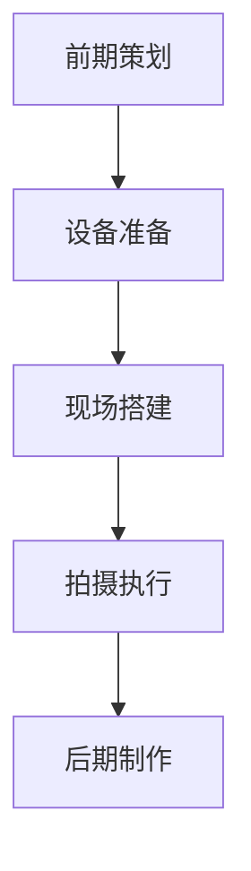

<div align="center">
  
  <h1>🎬 树莓技术库</h1>
  <p><em>流动的影像传承历史，不变的温度记录人文</em></p>
  
  [](https://vitepress.dev/)
  [](https://nodejs.org/)
  [](https://yarnpkg.com/)
  [](LICENSE)
  
  [📖 在线阅读](https://docs.szzxshumei.com/) • [🚀 快速开始](#快速开始) • [📝 贡献指南](#贡献指南)
</div>

---

## 📋 项目简介

**树莓技术库** 是苏州中学树莓社（Digital Media Association of SHS）的官方技术文档站点，致力于为数字媒体制作提供全面、专业的技术指导和最佳实践。

本项目基于现代化的 [VitePress](https://vitepress.dev/) 框架构建，具备以下特性：

- 🎨 **现代化设计**：响应式布局，支持深色/浅色主题切换
- 📱 **移动端优化**：完美适配各种设备屏幕
- 🔍 **全文搜索**：内置本地搜索功能
- 📊 **数学公式支持**：集成 KaTeX 渲染引擎
- 🎯 **链接预览**：智能内联链接预览
- 📈 **图表支持**：Mermaid 图表渲染
- ⚡ **极速加载**：静态站点生成，CDN 友好
- 🌐 **SEO 优化**：完整的 SEO 元数据和站点地图

## 🏗️ 项目架构

```
Shumei-Tech-Docs/
├── 📁 docs/                          # 文档根目录
│   ├── 📁 .vitepress/                # VitePress 配置
│   │   ├── 📁 components/            # Vue 组件
│   │   │   ├── Card.vue              # 卡片组件
│   │   │   ├── CollapsibleCard.vue   # 可折叠卡片
│   │   │   └── FontSwitcher.vue      # 字体切换器
│   │   ├── 📁 theme/                 # 主题定制
│   │   │   ├── index.js              # 主题入口
│   │   │   ├── style.css             # 主题样式
│   │   │   ├── customize.css         # 自定义样式
│   │   │   └── fonts.css             # 字体定义
│   │   └── config.mjs                # 站点配置
│   ├── 📁 guide/                     # 技术指南
│   │   ├── 📁 EFP/                   # 多机位制作 (12 篇)
│   │   ├── 📁 digital-video-post-production/  # 数字后期制作 (15 篇)
│   │   └── 📁 digital-media-tech/    # 数字媒体技术 (18 篇)
│   ├── 📁 about/                     # 团队介绍
│   ├── 📁 club-library/              # 社团文库
│   ├── 📁 public/                    # 静态资源
│   │   ├── 📁 fonts/                 # 字体文件
│   │   ├── 📁 icons/                 # 图标资源
│   │   └── 📁 images/                # 图片资源
│   └── index.md                      # 首页
├── package.json                      # 项目配置
├── yarn.lock                         # 依赖锁定
└── README.md                         # 项目说明
```

## 📚 内容体系

### 🎥 多机位制作 / EFP
现场电子新闻采集（Electronic Field Production）的完整工作流程，涵盖：

**前期准备**
- 📋 多机位制作策划与准备
- 👥 岗位分工与职责分配
- 🎛️ 设备清单与技术规格

**现场制作**
- 🔧 现场系统搭建与调试
- 📸 摄影摄像技术要点
- 🎯 机位设计与布局策略
- 🎬 导播切换技术指南
- 🎤 收声方案与音频处理

**后期参考**
- ✂️ 后期制作工作流程
- 📖 实际案例分析
- 📚 参考资料与扩展阅读

### 🎞️ 数字后期制作 / Post-production Workflow
系统性的视频后期制作教程，从基础到进阶：

**基础知识** (3 篇)
- 🔄 后期制作流程概述
- 📼 视频格式与编码标准
- 📂 项目管理与素材整理

**软件教程** (4 篇)
- 🟣 Adobe Premiere Pro 完整教程
- ⚫ DaVinci Resolve 专业指南
- 🔵 After Effects 特效制作
- 🟠 Audition 音频处理

**核心技能** (8 篇)
- ✂️ 视频编辑技巧与理论
- 🎨 调色技术与色彩管理
- 🔊 音频处理与混音
- ✨ 特效制作与合成
- 📤 输出优化与平台适配

### 💻 数字媒体技术 / Digital Media Technology
深入数字媒体技术的底层原理与前沿应用：

**底层逻辑** (3 篇)
- 📡 信号数字化原理
- 🌈 色彩科学核心理论
- ⏱️ 时间码与同步技术

**硬件技术** (3 篇)
- 💾 存储架构与性能优化
- 🖥️ 显示技术与色彩校准
- 📹 采集设备技术解析

**编码传输** (3 篇)
- 🔄 视频编码算法详解
- 📦 容器格式设计原理
- 🌐 流媒体传输体系

**前沿应用** (6 篇)
- 🎮 互动视频技术
- 🥽 AR/VR 技术架构
- 🎬 虚拟制片技术
- 🤖 AIGC 辅助技术
- 🔧 修复与增强技术
- 👤 虚拟人技术体系

**标准安全** (3 篇)
- 📏 行业技术标准
- 🔒 版权与加密技术
- 🛡️ 灾备与安全方案

## 🛠️ 技术栈

| 技术 | 版本 | 用途 |
|------|------|------|
| [VitePress](https://vitepress.dev/) | `^1.6.3` | 静态站点生成器 |
| [Vue.js](https://vuejs.org/) | `3.x` | 组件框架 |
| [Vite](https://vitejs.dev/) | `5.x` | 构建工具 |
| [@mdit/plugin-katex](https://github.com/mdit/mdit-plugins) | `^0.23.1` | 数学公式渲染 |
| [Mermaid](https://mermaid.js.org/) | `^10.9.1` | 图表绘制 |
| [@nolebase/vitepress-plugin-inline-link-preview](https://github.com/nolebase/integrations) | `^2.13.2` | 链接预览 |
| [markdown-it-footnote](https://github.com/markdown-it/markdown-it-footnote) | `^4.0.0` | 脚注支持 |
| [Font Awesome](https://fontawesome.com/) | `^7.0.0` | 图标库 |

## 🚀 快速开始

### 环境要求

- **Node.js**: `>= 18.0.0`
- **包管理器**: Yarn `1.22.22+` (推荐) 或 npm `8.0.0+`
- **操作系统**: Windows 10+, macOS 10.15+, Linux (Ubuntu 18.04+)

### 安装与运行

1. **克隆仓库**
   ```bash
   git clone https://github.com/Digital-Media-Association-of-SHS/Shumei-Tech-Docs.git
   cd Shumei-Tech-Docs
   ```

2. **安装依赖**
   ```bash
   # 使用 Yarn (推荐)
   yarn install
   
   # 或使用 npm
   npm install
   ```

3. **启动开发服务器**
   ```bash
   yarn docs:dev
   # 或 npm run docs:dev
   ```
   
   🌐 访问 `http://localhost:5173` 预览文档

4. **构建生产版本**
   ```bash
   yarn docs:build
   # 或 npm run docs:build
   ```
   
   📦 构建产物输出至 `docs/.vitepress/dist/`

5. **预览构建结果**
   ```bash
   yarn docs:preview
   # 或 npm run docs:preview
   ```

### 可用脚本

```bash
# 开发模式 (热重载)
yarn docs:dev

# 生产构建
yarn docs:build

# 预览构建结果
yarn docs:preview

# 清理缓存
yarn clean
```

## 📝 文档编写规范

为确保内容的一致性和专业性，我们制定了详细的编写规范：

### 📄 文档结构模板

每个文档应遵循以下标准结构：

```markdown
---
title: 文档标题
description: 简短描述 (用于 SEO)
prev:
  text: '上一页标题'
  link: '/上一页路径'
next:
  text: '下一页标题'
  link: '/下一页路径'
---

# 文档标题

> 📖 **本文概述**：简短介绍文档内容和学习目标 (1-2 段)

## 🎯 学习目标

- 目标 1
- 目标 2
- 目标 3

## 📋 前置知识

- 需要掌握的基础知识
- 相关文档链接

## 🔧 主要内容

### 第一部分标题

内容详述...

### 第二部分标题

内容详述...

## 💡 实践案例

具体的操作示例和案例分析

## 🔗 相关资源

- [相关文档 1](相对路径)
- [外部资源 1](外部链接)
- [工具推荐](工具链接)

## 📚 延伸阅读

- 进阶内容推荐
- 相关技术文档

---

> 💬 **反馈与建议**：如有疑问或建议，请联系 [树莓社团队](mailto:contact@szzxshumei.com)
```

### 📁 文件命名规范

| 规则 | 说明 | 示例 |
|------|------|------|
| 小写字母 | 全部使用小写 | `color-theory.md` |
| 连字符分隔 | 单词间用 `-` 连接 | `camera-layout.md` |
| 语义化命名 | 名称应反映内容 | `01-principles-of-signal-digitization.md` |
| 避免特殊字符 | 不使用空格、中文、符号 | ❌ `颜色 理论.md` ✅ `color-theory.md` |

### 🎨 内容格式规范

#### 标题层级

```markdown
# 一级标题 (文档标题，仅一个)
## 二级标题 (主要章节)
### 三级标题 (子章节)
#### 四级标题 (细分内容，谨慎使用)
```

#### 强调与标记

| 用途 | 语法 | 示例 |
|------|------|------|
| 重要概念 | `**粗体**` | **关键帧** |
| 技术术语 | `*斜体*` | *Frame Rate* |
| 代码/参数 | `` `代码` `` | `ffmpeg -i input.mp4` |
| 键盘按键 | `<kbd>按键</kbd>` | <kbd>Ctrl</kbd> + <kbd>C</kbd> |

#### 提示容器

```markdown
::: tip 💡 小贴士
有用的提示信息
:::

::: warning ⚠️ 注意
需要注意的重要信息
:::

::: danger 🚨 警告
可能导致问题的操作
:::

::: info ℹ️ 信息
补充说明信息
:::

::: details 🔍 详细信息
可折叠的详细内容
:::
```

### 🖼️ 媒体资源规范

#### 图片处理

| 要求 | 规范 | 说明 |
|------|------|------|
| 存储位置 | `/docs/public/images/[分类]/` | 按内容分类存储 |
| 文件格式 | WebP (推荐), PNG, JPG | 优先使用 WebP |
| 文件大小 | < 500KB | 压缩优化，提升加载速度 |
| 命名规范 | `kebab-case.webp` | 小写字母，连字符分隔 |
| 引用语法 | `` | 使用绝对路径 |

#### 图片示例

```markdown


<!-- 带尺寸控制 -->

```

### 📊 数学公式与图表

#### KaTeX 数学公式

```markdown
<!-- 行内公式 -->
帧率计算公式：$fps = \frac{frames}{time}$

<!-- 块级公式 -->
$$
SNR = 20 \log_{10} \left( \frac{Signal_{RMS}}{Noise_{RMS}} \right)
$$
```

#### Mermaid 图表

```markdown

```

## 🤝 贡献指南

我们欢迎所有形式的贡献！无论是内容补充、错误修正还是功能改进。

### 📋 贡献流程

1. **🍴 Fork 仓库**
   ```bash
   # 点击页面右上角的 Fork 按钮
   git clone https://github.com/YOUR_USERNAME/Shumei-Tech-Docs.git
   ```

2. **🌿 创建分支**
   ```bash
   git checkout -b feature/your-feature-name
   # 或
   git checkout -b fix/your-fix-name
   ```

3. **✏️ 进行修改**
   - 遵循 [文档编写规范](#📝-文档编写规范)
   - 确保内容准确性和专业性
   - 添加必要的图片和示例

4. **🧪 本地测试**
   ```bash
   yarn docs:dev  # 启动开发服务器
   yarn docs:build  # 测试构建
   ```

5. **📝 提交更改**
   ```bash
   git add .
   git commit -m "feat: 添加新的摄影技术教程"
   # 或
   git commit -m "fix: 修正色彩理论中的公式错误"
   ```

6. **🚀 推送并创建 PR**
   ```bash
   git push origin feature/your-feature-name
   # 然后在 GitHub 上创建 Pull Request
   ```

### 📝 提交信息规范

我们使用 [Conventional Commits](https://www.conventionalcommits.org/) 规范：

| 类型 | 说明 | 示例 |
|------|------|------|
| `feat` | 新功能或新内容 | `feat: 添加 DaVinci Resolve 调色教程` |
| `fix` | 错误修复 | `fix: 修正音频处理章节的技术错误` |
| `docs` | 文档更新 | `docs: 更新 README 安装说明` |
| `style` | 样式调整 | `style: 优化移动端显示效果` |
| `refactor` | 重构 | `refactor: 重组后期制作章节结构` |
| `perf` | 性能优化 | `perf: 压缩图片资源，提升加载速度` |

### 🎯 贡献重点

我们特别欢迎以下类型的贡献：

- 📚 **内容补充**：新的教程、案例研究、最佳实践
- 🔧 **技术更新**：最新软件版本的操作指南
- 🌍 **本地化**：英文内容翻译、术语标准化
- 🎨 **视觉优化**：图表、示意图、界面截图
- 🐛 **错误修正**：技术错误、拼写错误、链接失效
- 💡 **功能建议**：新的组件、插件、交互功能

### 👥 贡献者

感谢所有为项目做出贡献的开发者和内容创作者！

<!-- 贡献者列表将自动生成 -->

## 📄 许可证

本项目采用 [MIT License](LICENSE) 开源协议。

```
MIT License

Copyright (c) 2018-2025 苏州中学树莓社 Digital Media Association of SHS

Permission is hereby granted, free of charge, to any person obtaining a copy
of this software and associated documentation files (the "Software"), to deal
in the Software without restriction, including without limitation the rights
to use, copy, modify, merge, publish, distribute, sublicense, and/or sell
copies of the Software, and to permit persons to whom the Software is
furnished to do so, subject to the following conditions:

The above copyright notice and this permission notice shall be included in all
copies or substantial portions of the Software.
```

## 📞 联系我们

<div align="center">
  
  **苏州中学树莓社 Digital Media Association of SHS**
  
  🌐 [官方网站](https://szzxshumei.com/) • 📧 [联系邮箱](mailto:contact@szzxshumei.com) • 💬 [微信群](https://szzxshumei.com/wechat/)
  
  📱 [哔哩哔哩](https://space.bilibili.com/1234567890) • 🎵 [抖音](https://www.douyin.com/user/shumei) • 📺 [Vimeo](https://vimeo.com/shumei)
  
  ---
  
  <sub>🎬 流动的影像传承历史，不变的温度记录人文</sub>
  
  <sub>Made with ❤️ by Digital Media Association of SHS</sub>
  
</div>
 