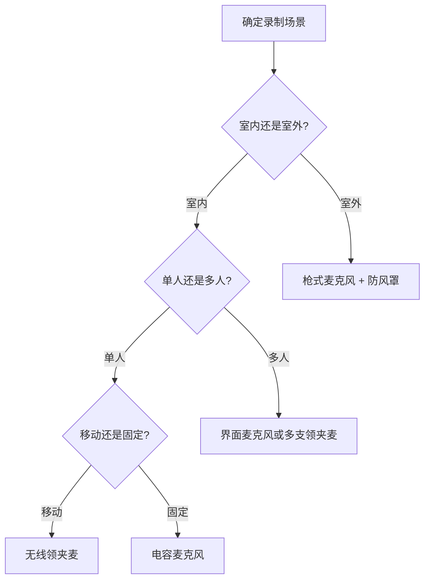
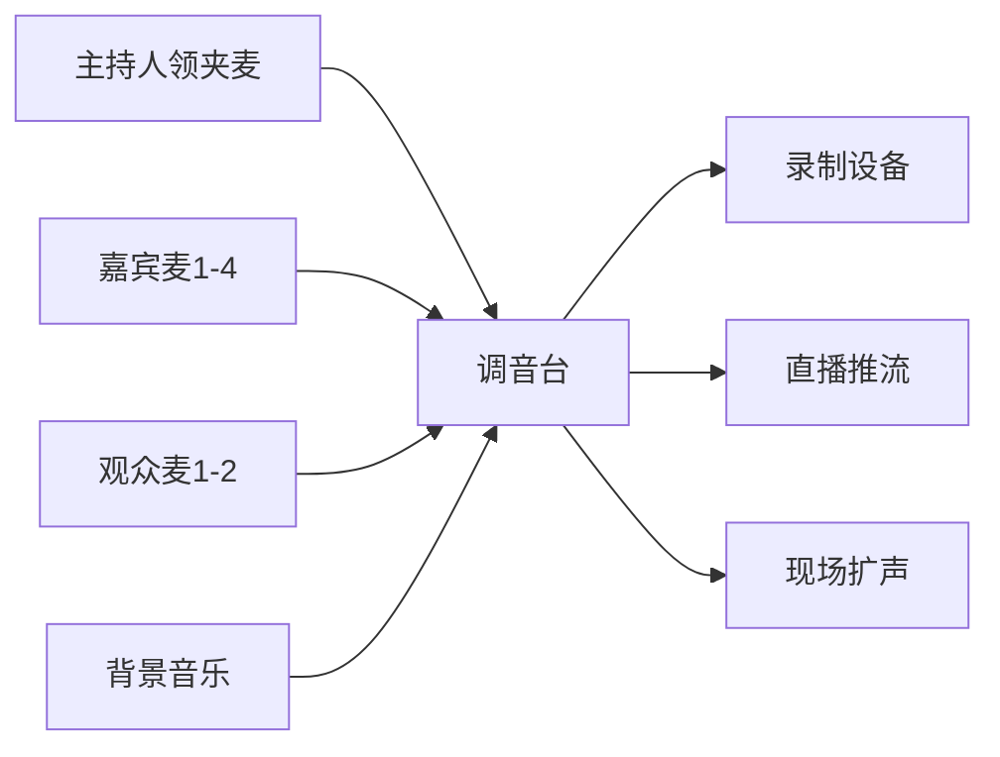
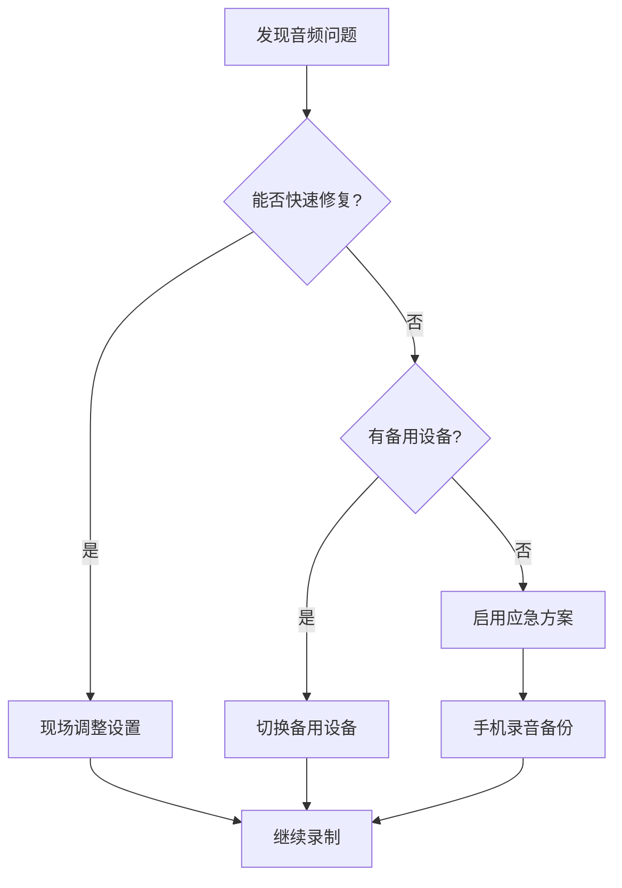

# 收声方案

声音是视频的重要组成部分，在关注画面的同时不能忽视声音的质量。**任何一次现场录制活动都应该考虑声音！**

多机位制作可以选择的收声方案种类较多，可以根据活动类型、经费、需求确定需要在收音方面的工作量。

::: warning 音频质量重要性
- **观众容忍度**：观众可以容忍画质稍差，但很难容忍音质不佳
- **后期修复难度**：音频问题比视频问题更难在后期修复
- **专业印象**：清晰的音频是专业制作的重要标志
:::

::: tip 收声方案复杂程度排序
按复杂程度依次排序可以粗略分为：
1. **相机麦克风直接录制** - 最简单，但音质有限
2. **使用手机专门采集需要的声音** - 成本低，适合应急
3. **从调音台录制** - 音质稳定，需要现场调音台
4. **专门架设麦克风录制** - 最专业，需要专业设备和技术
:::

## 音频技术基础

### 音频参数标准

| 参数 | 推荐值 | 说明 |
|------|--------|------|
| **采样率** | 48kHz | 视频制作标准，兼容性好 |
| **位深度** | 24bit | 提供足够的动态范围 |
| **音频格式** | WAV/AIFF | 无损格式，后期处理友好 |
| **录音电平** | -12dB 到 -6dB | 避免削波，保留余量 |

### 音频信号链路

## 常见立体声收音方法

录音中有三种最常见的立体声麦克风收音变量：**AB**、**XY** 和 **MS**。立体声录音包含两种通道信号。

### 立体声收音技术详解

| 方法 | 特点 | 适用场景 | 麦克风间距 |
|------|------|----------|------------|
| **AB 制式** | 自然宽广的立体声像 | 管弦乐队、合唱团 | 2-10 米 |
| **XY 制式** | 相位一致性好 | 独奏、小型乐队 | 重合或接近 |
| **MS 制式** | 可调节立体声宽度 | 广播、后期灵活性要求高 | 垂直重合 |

::: info 参考资料
详细的立体声收音方法请参考 Apple 官方文档：[立体声麦克风收音方法](https://support.apple.com/zh-cn/guide/logicpro/lgcef240ddb5/mac)
:::

## 常见收音设备和使用场景

### 麦克风设备对比

| 设备类型 | 使用场景 | 推荐型号 | 频响范围 | 价格区间 | 特点 |
|----------|----------|----------|----------|----------|------|
| **无线领夹麦** | 主持人、嘉宾讲话 | Rode Wireless GO II | 50Hz-20kHz | ¥1500-3000 | 隐蔽性好，移动自由，2.4GHz 传输 |
| **枪式麦克风** | 舞台表演/环境声采集 | Sennheiser MKE 600 | 40Hz-20kHz | ¥2000-4000 | 指向性强，抗噪能力好，需幻象电源 |
| **界面麦克风** | 圆桌会议/多人访谈 | Shure MXA910 | 100Hz-20kHz | ¥15000+ | 覆盖范围广，自动混音，网络控制 |
| **便携录音机** | 备份音轨/环境音录制 | Zoom H6 | 20Hz-20kHz | ¥2500-3500 | 多轨录制，音质优秀，XLR 接口 |
| **动圈麦克风** | 现场演出/访谈 | Shure SM58 | 50Hz-15kHz | ¥800-1200 | 耐用性强，抗反馈，无需幻象电源 |
| **电容麦克风** | 录音棚/高质量录制 | Audio-Technica AT4040 | 20Hz-20kHz | ¥1500-2500 | 灵敏度高，细节丰富，需幻象电源 |

### 设备选择决策树

## 设备资源

### 使用说明书
- [ZOOM H6 使用说明书](https://zoomcorp.com/media/documents/C_H6.pdf)

### 监听设备配置

监听设备是确保录音质量的重要环节，建议配备：

| 设备类型 | 推荐型号 | 价格区间 | 特点 | 使用场景 |
|----------|----------|----------|------|----------|
| **封闭式监听耳机** | Sony MDR-7506 | ¥800-1200 | 频响平直，隔音好 | 现场监听，后期制作 |
| **开放式监听耳机** | Sennheiser HD600 | ¥2000-3000 | 声场自然，长时间佩戴舒适 | 录音棚监听 |
| **近场监听音箱** | Yamaha HS5 | ¥1500/对 | 声音准确，体积适中 | 控制室监听 |
| **便携监听音箱** | JBL LSR305P | ¥1200/对 | 便携性好，声音清晰 | 现场快速监听 |
| **音频表/电平表** | Dorrough 40-A | ¥1000-2000 | 实时显示音频电平 | 防止过载削波 |

::: tip 监听技巧
- **音量设置**：监听音量应保持在舒适水平，避免听觉疲劳
- **环境噪音**：现场监听时要考虑环境噪音的影响
- **备用设备**：准备备用监听设备，防止关键时刻设备故障
:::

## 常见场景录音方案

### 场景 1：小型舞台演出

**主收音方案：**
- 2 支枪麦（左右立体声摆位）指向舞台前沿
- 备份方案：调音台 LINE OUT 接入切换台
- 环境音：1 支全向麦克风采集观众反应

**技术参数：**
- 麦克风高度：距离舞台 1.5-2 米
- 角度设置：指向舞台中心，避开音箱
- 增益设置：保持 -12dB 余量

**防啸叫技巧：**
- 麦克风避开舞台返送音箱辐射角度
- 合理设置增益，避免过度放大
- 使用图示均衡器切除易啸叫频段

### 场景 2：学术论坛直播

**设备配置：**
- **主持人**：无线领夹麦（隐藏于西装翻领）
- **嘉宾**：桌面鹅颈麦×4（需测试避免串音）
- **观众提问**：手持无线麦×2

**音频路由：**

**应急措施：**
- 控制室实时监听
- 备用电池包准备
- 手机录音作为最后备份

### 场景 3：户外活动直播

**挑战与解决方案：**

| 挑战 | 解决方案 | 备注 |
|------|----------|------|
| **风噪** | 防风罩 + 低切滤波器 | 建议使用毛绒防风罩 |
| **环境噪音** | 指向性麦克风 + 降噪处理 | 选择超心形指向 |
| **电源供应** | 大容量移动电源 + 备用电池 | 准备 2-3 倍用电时间 |
| **信号传输** | 无线系统 + 有线备份 | 测试无线频段干扰 |

### 场景 4：多人访谈节目

**最佳实践：**
- **一人一麦原则**：每人独立麦克风，便于后期调整
- **音频同步**：使用时间码或拍板同步
- **备份录制**：至少两套独立录音系统

**设备布局：**
- 主持人：头戴式麦克风（Shure SM35）
- 嘉宾：桌面麦克风支架 + 动圈麦（SM58）
- 环境：吊杆麦克风采集整体氛围

## 低成本方案

::: tip 经济实用的收音方案
- **手机录音**：使用 RecForge II APP 作为应急录音机
- **会议软件**：利用腾讯会议软件录制独立发言者音轨
- **USB 麦克风**：直接连接电脑，适合访谈节目
:::

### 预算分级方案

| 预算等级 | 总预算 | 设备配置 | 适用场景 |
|----------|--------|----------|----------|
| **入门级** | ¥500-1000 | 手机 + 领夹麦 + 三脚架 | 个人 Vlog、简单访谈 |
| **进阶级** | ¥2000-5000 | USB 麦克风 + 监听耳机 + 录音软件 | 播客、在线课程 |
| **专业级** | ¥8000-15000 | 无线麦克风系统 + 便携调音台 | 小型活动、企业直播 |
| **广播级** | ¥20000+ | 多通道录音设备 + 专业麦克风阵列 | 大型活动、专业制作 |

### DIY 解决方案

**自制防风罩：**
- 材料：海绵 + 丝袜 + 橡皮筋
- 成本：¥10-20
- 效果：可达到商业防风罩 70% 效果

**手机录音优化：**
- 推荐 APP：RecForge II、Hi-Q MP3 Voice Recorder
- 设置：48kHz/24bit WAV 格式
- 技巧：使用飞行模式避免通话干扰

## 故障排除指南

### 常见问题与解决方案

| 问题 | 可能原因 | 解决方案 |
|------|----------|----------|
| **无声音** | 连接问题、静音设置 | 检查连接线、确认输入选择 |
| **音量过小** | 增益设置过低 | 调整前置放大器增益 |
| **音质失真** | 输入过载 | 降低输入增益，检查削波指示 |
| **有杂音** | 接地问题、干扰 | 检查接地线、远离干扰源 |
| **延迟问题** | 缓冲区设置 | 调整音频接口缓冲区大小 |
| **无线断连** | 距离过远、电池不足 | 缩短距离、更换电池 |

### 应急处理流程

## 实用技巧与经验

### 现场录音检查清单

**设备检查：**
- [ ] 所有麦克风正常工作
- [ ] 电池电量充足（备用电池准备）
- [ ] 连接线无损坏
- [ ] 录音设备存储空间充足
- [ ] 监听设备正常

**音频测试：**
- [ ] 录制 30 秒测试音频
- [ ] 检查音频电平（-12dB 到 -6dB）
- [ ] 测试所有音频通道
- [ ] 确认音频同步

**环境评估：**
- [ ] 识别潜在噪音源
- [ ] 测试无线频段干扰
- [ ] 确认最佳麦克风位置
- [ ] 准备应急预案

### 后期处理建议

**音频清理：**
- 使用高通滤波器去除低频噪音（80-100Hz）
- 适度压缩动态范围（3:1 比例）
- 标准化音量到 -23 LUFS（广播标准）

**同步技巧：**
- 录制开始时拍手或使用拍板
- 使用时间码同步多设备
- 保留原始音频文件作为备份

## 相关文档

- [机位设计](/guide/EFP/camera-layout)
- [导播切换](/guide/EFP/live-switching)
- [后期制作](/guide/EFP/post-production)
- [设备清单](/guide/EFP/equipment-list)
- [系统搭建](/guide/EFP/system-setup)
- [活动策划](/guide/EFP/event-planning)
- [EFP 案例](/guide/EFP/EFP-examples)
- [参考资料](/guide/EFP/reference-materials)