# 多机位制作策划与前期准备

<div class="tip custom-block" style="padding-top: 8px">

**📋 文档概览**

本指南涵盖多机位制作的完整流程，从前期策划到后期制作，适合视频制作爱好者和小型制作团队参考使用。

**🎯 适用场景：** 会议记录 • 活动直播 • 访谈节目 • 培训录制

</div>

## 🎯 1. 项目策划与目标设定

### 1.1 明确制作目标

::: details 💡 制作目标清单

| 要素 | 说明 | 示例 |
|------|------|------|
| **内容定位** | 确定视频类型和风格 | 会议记录、活动直播、访谈节目 |
| **受众分析** | 分析目标观众特征 <mcreference link="https://m.shuziyingxiao.net/shhmt/spggyx/107750.html" index="3">3</mcreference> | 年龄段、兴趣爱好、观看习惯 |
| **传播渠道** | 选择发布平台 | B 站、抖音、YouTube、企业内网 |
| **预算规划** | 成本预估与分配 | 设备租赁、人员、后期制作 |

:::

### 1.2 制作规格确定

::: code-group

```yaml [视频规格]
分辨率: 
  - 1080P (1920×1080)
  - 4K (3840×2160)
帧率:
  - 25fps (标准)
  - 50fps (高帧率)
编码: H.264/H.265
```

```yaml [音频标准]
采样率: 48kHz
位深度: 24bit
声道配置:
  - 立体声 (2.0)
  - 环绕声 (5.1)
编码: AAC/PCM
```

```yaml [直播配置]
推流协议: RTMP/SRT
码率: 3-8Mbps
延迟: <3 秒
备份录制: 本地存储
```

:::

## 📹 2. 多机位配置与设备准备

### 2.1 机位数量与分工

::: tip 💡 机位配置原则
机位数量应根据预算、人员和拍摄需求合理配置，遵循"够用即可"的原则，避免过度配置造成资源浪费。
:::

#### 🔰 基础配置（2-3 机位）

**🎬 机位布局示意图**

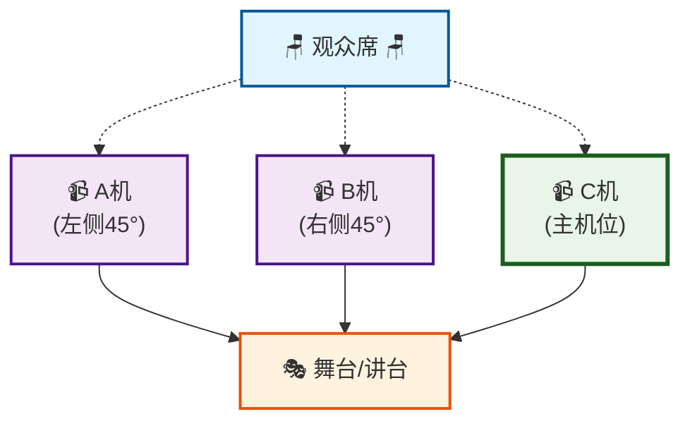

| 机位 | 位置 | 主要功能 | 镜头类型 |
|------|------|----------|----------|
| **C 机 (主)** | 中央正面 | 全景和主要内容 <mcreference link="https://zunzheng.com/news/archives/8371" index="4">4</mcreference> | 中景、全景 |
| **A 机 (左)** | 左侧 45° | 右侧区域特写 | 特写、中景 |
| **B 机 (右)** | 右侧 45° | 左侧区域特写 | 特写、中景 |

#### 🚀 进阶配置（4-5 机位）

::: details 📋 进阶机位详细配置

| 机位类型 | 设备要求 | 拍摄内容 | 技术要点 |
|----------|----------|----------|----------|
| **游动机位** | 手持稳定器 | 特殊角度和细节 <mcreference link="https://zhuanlan.zhihu.com/p/657972232" index="3">3</mcreference> | 灵活移动、快速对焦 |
| **高位机位** | 长焦镜头 | 俯拍全景 | 广角覆盖、稳定支撑 |
| **特写机位** | 中长焦镜头 | 人物表情细节 | 精准对焦、浅景深 |
| **反应机位** | 标准镜头 | 观众反应 | 快速切换、连续拍摄 |

:::

### 2.2 设备清单

::: warning ⚠️ 设备选择建议
设备选择应平衡预算与需求，建议优先保证音频质量，其次是画面稳定性，最后考虑画质提升。
:::

#### 📷 拍摄设备

::: details 🎥 摄像设备详细配置

**摄像机选择**
- **入门级**：Canon EOS M50、Sony α6400
- **专业级**：Sony FX6、Canon C70
- **广播级**：Sony PXW-Z190、Panasonic AG-CX350

**镜头配置** <mcreference link="https://zunzheng.com/news/archives/8371" index="4">4</mcreference>
| 焦段 | 用途 | 推荐型号 | 价格区间 |
|------|------|----------|----------|
| 14-35mm | 广角全景 | Sony 16-35mm f/2.8 | ¥8000-15000 |
| 19-90mm | 标准变焦 | Canon 24-70mm f/2.8 | ¥6000-12000 |
| 85-300mm | 长焦特写 | Sony 70-200mm f/2.8 | ¥10000-18000 |

**稳定设备**
- **三脚架**：Manfrotto 502 系列（每机位必备）
- **稳定器**：DJI RS3、Zhiyun Crane 系列

:::

#### 🎛️ 导播设备

| 设备类型 | 型号推荐 | 输入路数 | 价格区间 | 适用场景 |
|----------|----------|----------|----------|----------|
| **入门切换台** | ATEM Mini <mcreference link="https://www.blackmagicdesign.com/products/atemmini" index="4">4</mcreference> | 4 路 HDMI | ¥2000-3000 | 小型活动 |
| **专业切换台** | ATEM Television Studio | 8 路 SDI/HDMI | ¥15000-25000 | 中大型活动 |
| **监视器** | SmallHD 1303 HDR | - | ¥8000-12000 | 多画面监看 |
| **录制设备** | Atomos Ninja V | 1 路 HDMI | ¥3000-4000 | 高质量录制 |

#### 🎵 音频设备

::: code-group

```yaml [无线麦克风系统]
品牌: Sennheiser/Shure/Audio-Technica
频段: UHF (470-694MHz)
通道数: 2-8 通道
传输距离: 100-300 米
电池续航: 8-12 小时
```

```yaml [调音设备]
调音台: 
  - 入门: Behringer X32 Compact
  - 专业: Yamaha QL1
监听耳机:
  - Sony MDR-7506
  - Audio-Technica ATH-M50x
```

```yaml [收音设备]
指向性麦克风:
  - Rode VideoMic Pro Plus
  - Sennheiser MKE 600
环境音:
  - Zoom H6 便携录音机
  - Rode PodMic 播客麦克风
```

:::

#### 🔧 辅助设备

::: details 📦 辅助设备清单

**通讯设备**
- **对讲系统** <mcreference link="https://zhuanlan.zhihu.com/p/657972232" index="3">3</mcreference>：Motorola T82、Baofeng UV-5R
- **手机热点**：4G/5G 备用网络

**线缆配件**
- **HDMI 线缆**：5-15 米，支持 4K 传输
- **SDI 线缆**：BNC 接头，50-100 米
- **电源延长线**：16A 工业插座
- **网线**：Cat6，支持千兆传输

**存储备份**
- **存储卡**：SanDisk Extreme Pro 128GB×4
- **移动硬盘**：2TB SSD，USB 3.0
- **备用电池**：NP-F970×6，充电器×2

**其他工具**
- **工具箱**：螺丝刀、扳手、胶带
- **标签贴**：设备标识和线缆管理
- **防雨罩**：户外拍摄防护

:::

## 👥 3. 人员配置与分工

### 3.1 核心团队构成

::: tip 💡 团队配置原则
团队规模应与项目复杂度匹配，确保每个关键岗位都有专人负责，同时避免人员冗余增加成本。
:::

#### 🔰 最小团队（3-4 人）

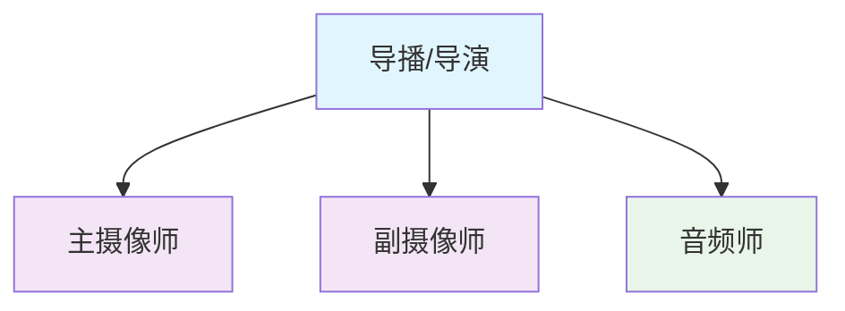

| 岗位 | 主要职责 | 技能要求 | 工作强度 |
|------|----------|----------|----------|
| **导播/导演** | 统筹全局，画面切换 <mcreference link="https://www.woshipm.com/operate/431356.html" index="2">2</mcreference> | 切换台操作、节奏感 | ⭐⭐⭐⭐⭐ |
| **主摄像师** | 主机位操作 | 构图技巧、设备熟练 | ⭐⭐⭐⭐ |
| **副摄像师** | 副机位和游动拍摄 | 灵活应变、体力好 | ⭐⭐⭐⭐ |
| **音频师** | 音频监控调节 | 调音台操作、听觉敏感 | ⭐⭐⭐ |

#### 🚀 标准团队（5-6 人）

::: details 📋 标准团队详细分工

**管理层**
- **总导播**：整体协调和决策，负责与客户沟通
- **技术协调员**：设备维护和故障处理，现场技术支持

**执行层**
- **切换导播**：专门负责画面切换，操作导播台
- **摄像师 A/B/C**：每个固定机位配备专人
- **音频工程师**：专业音频处理和现场调音

**支持层**
- **助理**：设备搬运、线缆管理、后勤保障

:::

### 3.2 人员技能要求

#### 🎯 导播技能矩阵

| 技能类别 | 具体要求 | 重要程度 | 培养周期 |
|----------|----------|----------|----------|
| **技术操作** | 熟练掌握切换台操作 | ⭐⭐⭐⭐⭐ | 2-4 周 |
| **艺术素养** | 良好的节奏感和画面感 | ⭐⭐⭐⭐ | 3-6 个月 |
| **沟通协调** | 团队协调和指挥能力 | ⭐⭐⭐⭐⭐ | 6 个月 -1 年 |
| **应急处理** | 快速解决突发问题 | ⭐⭐⭐⭐ | 1-2 年经验 |

#### 📹 摄像师技能要求

::: code-group

```yaml [基础技能]
设备操作:
  - 摄像机参数设置
  - 镜头焦距控制
  - 白平衡调节
  - 曝光补偿

构图技巧:
  - 三分法则
  - 景深控制
  - 运镜技巧
  - 画面构成
```

```yaml [进阶技能]
团队协作:
  - 对讲系统使用
  - 手势信号理解
  - 快速响应指令
  - 预判拍摄需求

体能要求:
  - 长时间站立
  - 设备搬运
  - 快速移动
  - 注意力集中
```

```yaml [专业素养]
职业道德:
  - 保守客户秘密
  - 尊重拍摄对象
  - 遵守现场规定
  - 维护设备安全

持续学习:
  - 关注技术发展
  - 学习新设备操作
  - 提升艺术修养
  - 积累行业经验
```

:::

## 🔍 4. 前期准备工作

::: danger ⚠️ 重要提醒
前期准备是多机位制作成功的关键，建议提前 1-2 天完成所有准备工作，留出充足的调试时间。
:::

### 4.1 场地勘测

#### 📐 现场勘测检查表

| 检查项目 | 具体内容 | 注意事项 | 解决方案 |
|----------|----------|----------|----------|
| **空间布局** | 机位摆放位置规划 | 避免相互干扰、确保安全通道 | 绘制现场平面图 |
| **光线条件** | 自然光和人工照明评估 | 色温统一、避免逆光 | 制定补光方案 |
| **电源配置** | 供电点位和负载能力 | 确保用电安全、准备 UPS | 电源分配图 |
| **网络环境** | 带宽测试和稳定性 | 上传速度≥10Mbps | 4G/5G备用方案 |
| **声学环境** | 环境噪音和混响 | 识别噪音源、评估影响 | 降噪设备配置 |

::: details 🏗️ 场地勘测详细流程

**第一步：基础信息收集**
- 场地面积和层高
- 出入口位置和数量
- 停车和卸货便利性
- 现场联系人信息

**第二步：技术环境评估**
- 电力系统容量和分布
- 网络接入方式和带宽
- 空调和通风系统
- 消防和安全设施

**第三步：拍摄条件分析**
- 最佳机位位置标记
- 光线变化规律记录
- 声学特性测试
- 潜在干扰因素识别

:::

### 4.2 技术测试

#### 🔧 设备测试流程

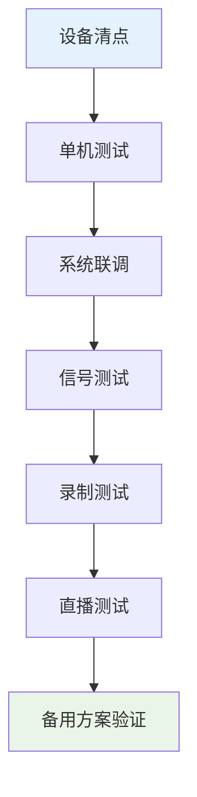

::: code-group

```bash [设备检查脚本]
#!/bin/bash
# 设备状态检查清单

echo "=== 摄像设备检查 ==="
echo "□ 摄像机电池电量 >80%"
echo "□ 存储卡格式化完成"
echo "□ 镜头清洁无污渍"
echo "□ 三脚架稳定性测试"

echo "\n=== 音频设备检查 ==="
echo "□ 无线麦电池满电"
echo "□ 频率扫描无干扰"
echo "□ 音频电平正常"
echo "□ 监听耳机功能正常"

echo "\n=== 导播设备检查 ==="
echo "□ 切换台固件最新"
echo "□ 所有输入信号正常"
echo "□ 录制存储空间充足"
echo "□ 网络推流测试通过"
```

```yaml [测试时间安排]
设备入场: T-3 小时
单机测试: T-2.5 小时 (30 分钟)
系统联调: T-2 小时 (30 分钟)
信号测试: T-1.5 小时 (30 分钟)
录制测试: T-1 小时 (30 分钟)
直播测试: T-0.5 小时 (30 分钟)
最终检查: T-0 小时 (开始前)
```

```json [测试记录表]
{
  "测试项目": {
    "视频信号": {
      "分辨率": "1920x1080",
      "帧率": "25fps",
      "色彩空间": "Rec.709",
      "状态": "✅ 正常"
    },
    "音频信号": {
      "采样率": "48kHz",
      "位深度": "24bit",
      "声道": "立体声",
      "状态": "✅ 正常"
    },
    "网络推流": {
      "上传带宽": "15Mbps",
      "延迟": "2.3 秒",
      "丢包率": "0.1%",
      "状态": "✅ 正常"
    }
  }
}
```

:::

### 4.3 流程设计

#### ⏰ 时间节点规划

::: info 制作时间线

**⏰ T-3 小时：设备入场**
- 设备运输和搬入
- 现场安全检查
- 基础设施确认

**⏰ T-2 小时：系统搭建**
- 机位架设和调试
- 线缆连接和整理
- 导播台配置

**⏰ T-1 小时：联调测试**
- 全系统联调
- 信号质量检查
- 通讯系统测试

**⏰ T-30 分钟：彩排**
- 完整流程演练
- 问题发现和解决
- 最终确认

**⏰ T-0：正式开始**
- 按活动流程执行
- 实时监控和调整
- 应急处理准备

**⏰ T+ 结束：撤场**
- 设备安全关闭
- 素材备份确认
- 设备打包撤场

:::

#### 📋 拍摄脚本制作

::: details 📝 脚本模板示例

**镜头分配表**
| 时间段 | A 机位 | B 机位 | C 机位 | 音频 | 备注 |
|--------|-------|-------|-------|------|------|
| 开场 | 观众全景 | 主持人特写 | 舞台全景 | 现场音 | 氛围营造 |
| 致辞 | 致辞人特写 | 观众反应 | 中景 | 领夹麦 | 重点内容 |
| 表演 | 表演者特写 | 侧面角度 | 全景 | 舞台音响 | 艺术表现 |

**切换提示**
- 🔴 **关键时刻**：嘉宾入场、重要发言、颁奖瞬间
- 🟡 **过渡时刻**：掌声、音乐间奏、场景转换
- 🟢 **常规时刻**：日常对话、观众反应、环境展示

**特殊要求**
- ❌ **禁拍内容**：商业机密、个人隐私、安全区域
- ⭐ **重点镜头**：签约仪式、合影留念、精彩瞬间
- 🎵 **音频提示**：麦克风切换、音量调节、背景音乐

:::

## 🎬 5. 现场执行要点

### 5.1 开机前检查

::: tip 🔍 检查要点
开机前的系统性检查是确保拍摄顺利进行的最后一道防线，务必逐项确认。
:::

#### ✅ 开机检查清单

::: code-group

```yaml [视频系统检查]
白平衡设置:
  - 使用标准白板统一色温 <mcreference link="https://zhuanlan.zhihu.com/p/657972232" index="3">3</mcreference>
  - 各机位色温一致性检查
  - 自动/手动模式确认

画面质量:
  - 焦点清晰度检查
  - 曝光补偿调整
  - 画面构图确认
  - 景深效果验证

录制设置:
  - 分辨率和帧率确认
  - 编码格式设置
  - 文件命名规则
  - 时码同步检查
```

```yaml [音频系统检查]
麦克风测试:
  - 无线麦频率扫描
  - 电池电量确认 >80%
  - 音频电平调整
  - 监听耳机测试

调音台设置:
  - 输入增益调整
  - 均衡器设置
  - 压缩器参数
  - 主输出电平

录音质量:
  - 采样率48kHz确认
  - 位深度24bit设置
  - 噪音底噪检查
  - 声道分配确认
```

```yaml [系统状态检查]
存储容量:
  - 存储卡剩余空间 >2小时
  - 备用存储卡准备
  - 自动备份设置
  - 文件完整性验证

网络连接:
  - 推流地址确认
  - 带宽测试 >10Mbps
  - 延迟测试 <3秒
  - 备用网络准备

通讯系统:
  - 对讲频道测试
  - 音量调节适中
  - 电池电量充足
  - 备用设备准备
```

:::

### 5.2 拍摄过程管理

#### 🎯 实时操作要点

**录制管理**
- **连续录制原则** <mcreference link="https://zhuanlan.zhihu.com/p/657972232" index="3">3</mcreference>：各机位保持连续录制，避免重要内容遗漏
- **存储卡轮换**：在 57-63 分钟时更换存储卡，避免单文件过大
- **备份策略**：重要内容双机位同时录制
- **文件管理**：及时标记重要片段和问题片段

**画面切换技巧**
- **基本原则** <mcreference link="https://zhuanlan.zhihu.com/p/61125931" index="2">2</mcreference>：遵循"谁说话切谁"的基本原则
- **节奏控制**：根据内容节奏调整切换频率
- **反应镜头**：适时切换到观众或其他参与者的反应
- **过渡技巧**：使用淡入淡出等过渡效果

::: details 📺 画面切换进阶技巧

**切换时机把握**
- **语言停顿**：在说话者停顿时切换
- **动作完成**：在手势或动作完成后切换
- **音乐节拍**：配合背景音乐的节拍切换
- **情绪转换**：在情绪变化时切换角度

**镜头语言运用**
- **建立镜头**：用全景展示环境和人物关系
- **特写镜头**：突出重要表情和细节
- **反应镜头**：展示观众或其他人的反应
- **过渡镜头**：用中景连接不同场景

:::

### 5.3 应急处理

#### 🚨 应急响应流程

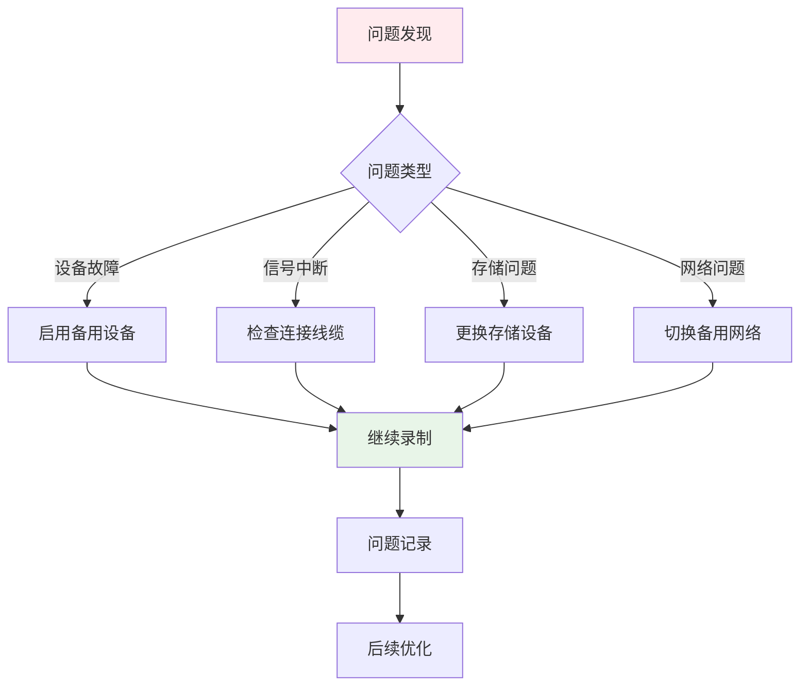

#### 📋 常见问题处理手册

| 问题类型 | 症状表现 | 应对措施 | 预防方法 | 处理时间 |
|---------|----------|----------|----------|----------|
| **设备故障** | 画面黑屏、无信号 | 立即启用备用设备 | 提前准备备用机 | <2 分钟 |
| **存储卡满** | 录制停止提示 | 快速更换新卡 | 监控录制时长 | <30 秒 |
| **网络中断** | 推流断开 | 切换 4G/5G 热点 | 准备多路网络 | <1 分钟 |
| **音频问题** | 无声音、噪音 | 调整麦克风或切换音源 | 提前音频测试 | <1 分钟 |
| **画面抖动** | 画面不稳定 | 检查三脚架固定 | 定期检查设备 | <30 秒 |
| **色温偏差** | 画面偏色 | 重新设置白平衡 | 统一光源环境 | <2 分钟 |
| **对焦失误** | 画面模糊 | 手动对焦调整 | 预设对焦点 | <30 秒 |

::: warning ⚠️ 应急处理注意事项
1. **保持冷静**：遇到问题时保持冷静，按流程处理
2. **快速响应**：争取在最短时间内恢复正常
3. **沟通及时**：立即通知相关人员问题状态
4. **记录详细**：详细记录问题和处理过程
5. **持续监控**：处理后持续监控设备状态
:::

## 🎞️ 6. 后期制作准备

::: info 💡 后期制作要点
多机位素材的后期处理需要系统性的工作流程，合理的素材管理和高效的剪辑技巧是关键。
:::

### 6.1 素材整理

#### 📁 素材管理工作流


::: code-group

```bash [文件命名规范]
# 推荐的文件命名格式
项目名_日期_机位_时间段.扩展名

# 示例
AnnualMeeting_20241201_CamA_Part01.mp4
AnnualMeeting_20241201_CamB_Part01.mp4
AnnualMeeting_20241201_CamC_Part01.mp4
AnnualMeeting_20241201_Audio_Main.wav

# 目录结构
项目文件夹/
├── 01_原始素材/
│   ├── 视频/
│   ├── 音频/
│   └── 其他/
├── 02_同步素材/
├── 03_剪辑工程/
└── 04_输出成品/
```

```yaml [同步对齐流程]
音频波形对齐: <mcreference link="https://zhuanlan.zhihu.com/p/657972232" index="3">3</mcreference>
  - 导入所有机位素材
  - 选择音质最佳的音轨作为参考
  - 使用波形匹配自动对齐
  - 手动微调时间偏差

时码同步:
  - 检查各机位时码一致性
  - 处理时码断续问题
  - 建立统一时间基准
  - 验证同步准确性

质量检查:
  - 画面清晰度检查
  - 音频质量评估
  - 色彩一致性检查
  - 文件完整性验证
```

```json [素材分类标准]
{
  "按内容分类": {
    "开场": "活动开始、嘉宾入场",
    "主体": "核心内容、重要发言",
    "互动": "问答环节、观众反应",
    "结尾": "总结致辞、合影留念"
  },
  "按质量分类": {
    "A级": "画面音频俱佳，可直接使用",
    "B级": "需要简单处理后使用",
    "C级": "仅作备用或特殊用途",
    "废料": "无法使用的素材"
  },
  "按用途分类": {
    "主线": "主要剪辑素材",
    "插入": "穿插使用的镜头",
    "备用": "备选方案素材",
    "花絮": "幕后花絮素材"
  }
}
```

:::

### 6.2 剪辑工作流

#### 🎬 多轨道编辑策略

::: details 📋 剪辑软件配置建议

**轨道分配**
- **V1-V3**：主要机位视频轨道
- **V4-V6**：辅助机位和特效轨道
- **A1-A2**：主音频轨道（立体声）
- **A3-A4**：环境音和音效轨道
- **A5-A6**：备用音频轨道

**时间线设置**
- **项目帧率**：与拍摄帧率一致
- **分辨率**：1920×1080 或 3840×2160
- **色彩空间**：Rec.709 或 Rec.2020
- **音频采样率**：48kHz/24bit

**代理文件**
- **代理分辨率**：1/4 原始分辨率
- **代理编码**：H.264 Low Quality
- **代理存储**：高速 SSD
- **链接管理**：保持原始文件路径

:::

#### 🎨 后期处理技巧

| 处理环节 | 主要任务 | 技术要点 | 推荐工具 |
|----------|----------|----------|----------|
| **粗剪** | 内容筛选和结构搭建 | 快速浏览、标记重点 | Premiere Pro |
| **精剪** | 画面切换和节奏调整 | 切换点选择、过渡效果 | Final Cut Pro |
| **调色** | 色彩统一和风格化 | 一级调色、二级调色 | DaVinci Resolve |
| **音频** | 音频清理和混音 | 降噪、均衡、压缩 | Pro Tools |
| **特效** | 字幕、图形、动画 | 模板应用、自定义设计 | After Effects |
| **输出** | 格式转换和压缩 | 编码参数、质量控制 | Media Encoder |

## 💰 7. 成本控制与优化建议

### 7.1 设备投资策略

#### 📊 设备投资优先级矩阵

| 设备类型 | 购买建议 | 租赁建议 | 投资回报周期 | 备注 |
|----------|----------|----------|--------------|------|
| **切换台** | ⭐⭐⭐⭐⭐ | ⭐⭐ | 6-12 个月 | 核心设备，建议购买 |
| **监视器** | ⭐⭐⭐⭐ | ⭐⭐⭐ | 8-15 个月 | 高频使用，建议购买 |
| **摄像机** | ⭐⭐⭐ | ⭐⭐⭐⭐⭐ | 18-24 个月 | 更新换代快，建议租赁 |
| **镜头** | ⭐⭐ | ⭐⭐⭐⭐⭐ | 24-36 个月 | 专业镜头昂贵，建议租赁 |
| **音频设备** | ⭐⭐⭐⭐ | ⭐⭐⭐ | 12-18 个月 | 稳定性重要，建议购买 |
| **辅助设备** | ⭐⭐⭐⭐⭐ | ⭐ | 3-6 个月 | 基础设备，建议购买 |

::: tip 💡 投资建议
- **优先购买**：使用频率高、技术更新慢的设备
- **优先租赁**：价格昂贵、技术更新快的设备
- **共享合作**：与其他团队共享大型设备，降低成本
:::

### 7.2 团队能力建设

#### 🎓 培训体系规划

::: code-group

```yaml [基础培训(1-2周)]
设备操作:
  - 摄像机基础操作
  - 切换台使用方法
  - 音频设备调试
  - 安全操作规范

理论知识:
  - 视频制作基础
  - 构图和运镜
  - 音频录制原理
  - 团队协作规范
```

```yaml [进阶培训(1-3个月)]
专业技能:
  - 多机位导播技巧
  - 现场应急处理
  - 设备维护保养
  - 客户沟通技巧

实战演练:
  - 模拟项目练习
  - 真实项目参与
  - 问题案例分析
  - 经验分享交流
```

```yaml [高级培训(持续学习)]
技术前沿:
  - 新设备学习
  - 新技术应用
  - 行业趋势分析
  - 创新方法探索

管理技能:
  - 项目管理
  - 团队领导
  - 成本控制
  - 质量管理
```

:::

### 7.3 质量管理体系

#### 📈 持续改进机制

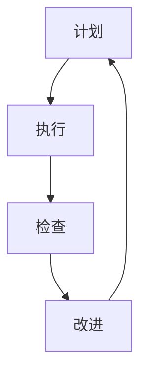

::: details 📋 质量管理要点

**标准化流程**
- 制定详细的作业指导书
- 建立质量检查清单
- 规范设备操作流程
- 统一文档管理标准

**设备维护**
- 定期清洁和保养
- 及时校准和检测
- 建立设备档案
- 制定更新计划

**技术更新**
- 关注行业发展动态
- 参加专业展会培训
- 试用新技术设备
- 评估升级必要性

**经验积累**
- 项目复盘总结
- 问题案例收集
- 最佳实践分享
- 知识库建设

:::

## 🛠️ 8. 实用工具与资源

### 8.1 软件工具推荐

#### 💻 直播制作软件对比

| 软件名称 | 类型 | 价格 | 适用场景 | 优势 | 劣势 |
|----------|------|------|----------|------|------|
| **OBS Studio** | 免费开源 | 免费 | 入门级直播 | 完全免费、插件丰富 | 学习曲线陡峭 |
| **vMix** | 商业软件 | $60-$1200 | 专业制作 | 功能强大、稳定性好 | 价格较高 |
| **Wirecast** | 商业软件 | $499-$999 | 中小型制作 | 易于使用、模板丰富 | 功能相对有限 |
| **ATEM Software** | 免费配套 | 免费 | 硬件切换台 | 与硬件完美集成 | 依赖特定硬件 |

::: code-group

```yaml [OBS Studio配置]
基础设置:
  视频:
    基础分辨率: 1920x1080
    输出分辨率: 1920x1080
    帧率: 30fps
  音频:
    采样率: 48kHz
    声道: 立体声

推荐插件:
  - StreamFX: 高级滤镜效果
  - Advanced Scene Switcher: 自动场景切换
  - Source Record: 独立录制源
  - NDI Plugin: 网络视频传输
```

```yaml [后期制作软件]
DaVinci Resolve:
  优势: 免费版功能强大
  适用: 调色、剪辑、音频处理
  学习资源: 官方免费教程

Adobe Premiere Pro:
  优势: 行业标准、插件丰富
  适用: 专业剪辑制作
  订阅: Creative Cloud 套装

Final Cut Pro:
  优势: Mac 平台优化
  适用: 苹果生态系统
  价格: 一次性购买
```

:::

### 8.2 硬件设备选型

#### 📹 设备选型决策树

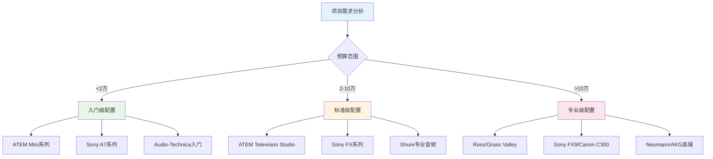

### 8.3 学习资源与社区

#### 📚 推荐学习路径

::: code-group

```yaml [官方资源]
Blackmagic Design:
  - 官方培训视频
  - DaVinci Resolve认证
  - 技术支持文档
  - 用户论坛

Sony Professional:
  - 产品培训课程
  - 技术白皮书
  - 案例研究
  - 在线研讨会
```

```yaml [在线平台]
中文资源:
  - B站: 设备评测、教程分享
  - 知乎: 技术讨论、经验分享
  - 影视工业网: 专业交流平台
  - 新片场: 创作者社区

英文资源:
  - YouTube: 官方频道、技术评测
  - Reddit: r/videography 社区
  - NAB Show: 行业展会资源
  - Creative COW: 专业论坛
```

```yaml [线下培训]
认证课程:
  - Blackmagic认证培训师
  - Adobe认证专家
  - Avid认证用户
  - Apple认证培训

行业活动:
  - NAB Show: 全球广播设备展
  - IBC: 欧洲广播展
  - BIRTV: 北京国际广播电影电视展览会
  - 地方摄影协会活动
```

:::

::: warning 注意事项
1. 多机位制作需要团队密切配合，建议提前进行充分演练
2. 设备故障是常见问题，务必准备备用设备和应急方案
3. 音频质量往往比画面更重要，不要忽视音频设备的配置
4. 现场环境复杂多变，保持灵活应变的心态很重要
:::

## 📊 9. 案例分析

#### 💡 关键经验

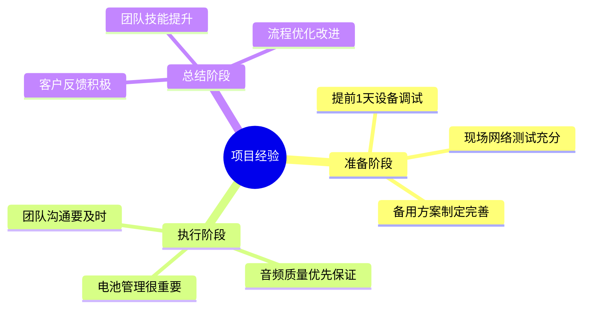

::: tip 💡 成功要点
- **充分准备**：提前 1 天完成所有设备调试和网络测试
- **备用方案**：准备了双倍电池和备用网络连接
- **团队协作**：3 人团队分工明确，沟通顺畅
- **质量控制**：现场实时监控画面和音频质量
:::

::: warning ⚠️ 遇到的问题
- **电池耗尽**：中途一台摄像机电池耗尽，5 分钟内完成更换
- **网络波动**：主网络出现短暂中断，立即切换备用 4G 热点
- **音频干扰**：发现轻微电磁干扰，调整话筒频率解决
:::

### 9.2 大型活动多机位制作案例

#### 🏢 项目挑战与解决方案

| 项目维度 | 挑战 | 解决方案 | 效果 |
|----------|------|----------|------|
| **技术难点** | 多机位色彩统一 | 统一白平衡和 LUT | 色彩一致性>95% |
| **音频同步** | 6 路音频延迟不一 | 使用时码同步器 | 音画同步误差<40ms |
| **存储管理** | 4K 素材存储压力 | 分布式存储 + 代理 | 存储效率提升 60% |
| **直播稳定** | 高并发观看需求 | CDN 多节点分发 | 支持 3000 并发 |

#### 🎬 制作流程图

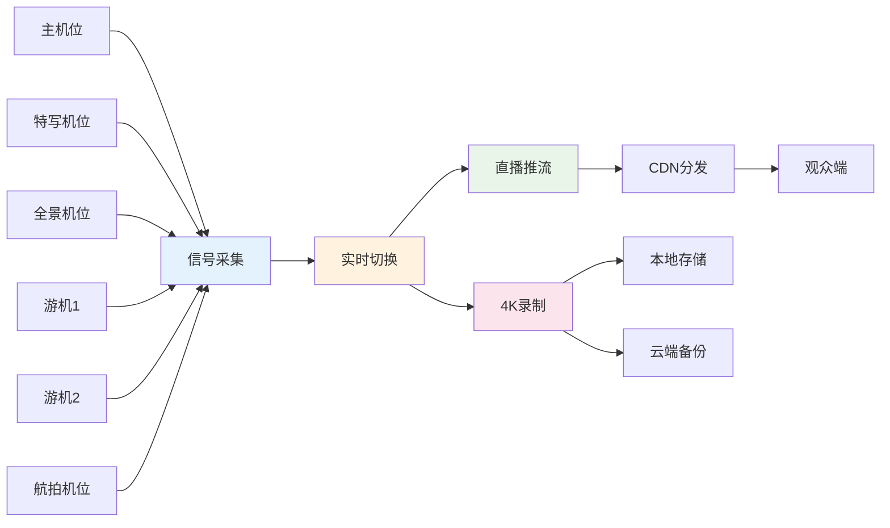

#### 📈 项目成果

::: code-group

```yaml [技术指标]
画面质量:
  分辨率: 4K 录制/1080P 直播
  帧率: 25fps 稳定
  色彩: 统一校准
  清晰度: 专业级别

音频质量:
  采样率: 48kHz/24bit
  信噪比: >60dB
  动态范围: 优秀
  同步精度: <40ms

直播稳定性:
  在线观看: 3000 人并发
  卡顿率: <0.1%
  延迟: <3 秒
  可用性: 99.9%
```

```yaml [商业价值]
客户满意度:
  画面质量: 9.5/10
  音频效果: 9.3/10
  直播稳定: 9.8/10
  服务态度: 9.7/10

业务影响:
  后续合作: 增加 3 个项目
  推荐客户: 新增 5 个潜在客户
  品牌提升: 行业知名度显著提高
  团队成长: 技能水平整体提升
```

```yaml [效率提升]
制作效率:
  前期准备: 缩短 20%
  现场执行: 提升 30%
  后期剪辑: 缩短 50%
  交付周期: 提前 2 天

成本控制:
  设备利用率: 提升 40%
  人员效率: 提升 25%
  返工率: 降低 80%
  总体成本: 节省 15%
```

:::

### 9.3 预算优化实战案例

#### 💰 挑战：5000 元预算完成 3 机位制作

#### 🎯 优化策略

```mermaid
sankey-beta
    title 成本优化分配
    
    总预算,设备租赁,3000
    总预算,人员成本,1500
    总预算,其他费用,500
    
    设备租赁,摄像设备,2000
    设备租赁,音频设备,600
    设备租赁,辅助设备,400
    
    人员成本,导播,600
    人员成本,摄像师A,450
    人员成本,摄像师B,450
    
    其他费用,交通,200
    其他费用,餐饮,200
    其他费用,杂费,100
```

::: details 📋 成本分解与优化

**设备成本优化（3000 元）**
- **摄像设备**：租赁 3 台入门级摄像机（2000 元/3 天）
- **音频设备**：租赁无线话筒系统（600 元/3 天）
- **辅助设备**：三脚架、监视器等（400 元/3 天）

**人员成本控制（1500 元）**
- **导播**：600 元（技能要求高，薪酬相对较高）
- **摄像师 A**：450 元（主机位，经验丰富）
- **摄像师 B**：450 元（辅助机位，可用新手）

**其他费用（500 元）**
- **交通费**：200 元（团队往返交通）
- **餐饮费**：200 元（工作餐和饮料）
- **杂费**：100 元（存储卡、电池等消耗品）

**优化措施**
- 选择性价比高的租赁商
- 团队成员一人多岗
- 使用免费软件 OBS Studio
- 合理安排拍摄时间

:::

#### 📊 效果评估

| 评估维度 | 目标 | 实际结果 | 达成度 |
|----------|------|----------|--------|
| **预算控制** | ≤5000 元 | 4950 元 | ✅ 99% |
| **画面质量** | 1080P 清晰 | 1080P/30fps | ✅ 100% |
| **音频质量** | 无杂音 | 清晰无干扰 | ✅ 100% |
| **交付时间** | 按时完成 | 提前半天 | ✅ 110% |
| **客户满意** | ≥8 分 | 8.5 分 | ✅ 106% |

::: tip 💡 关键成功因素
- **精准预算**：每一项支出都经过仔细计算
- **团队协作**：3 人团队配合默契，效率很高
- **技术选择**：使用成熟稳定的免费软件
- **经验积累**：通过项目实践提升了团队整体技能
:::

## ❓ 10. 常见问题解答

### 🔧 技术问题

::: details Q1: 初学者应该从几个机位开始？

**推荐学习路径**

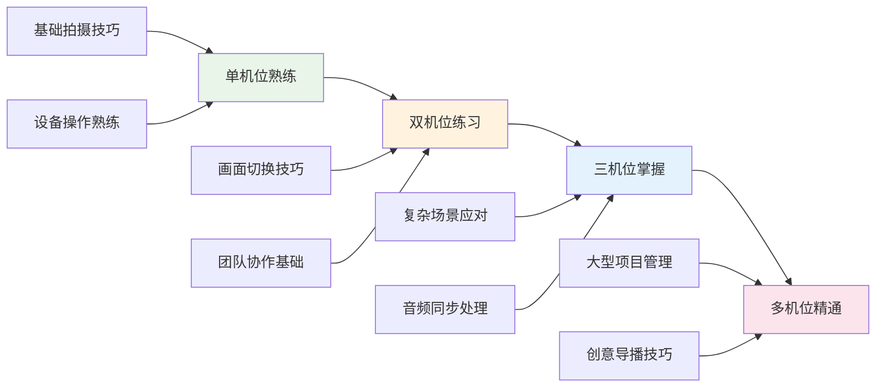

**具体建议**
- **第 1-2 周**：单机位拍摄，熟悉设备操作
- **第 3-4 周**：双机位练习，学习基本切换
- **第 2-3 个月**：三机位制作，掌握团队协作
- **3 个月以上**：多机位项目，提升专业水平

**技能检查清单**
- ✅ 熟练操作摄像设备
- ✅ 理解构图和运镜原理
- ✅ 掌握音频录制技巧
- ✅ 具备基本的团队沟通能力

:::

::: details Q2: 多机位制作最容易出现什么问题？

**常见问题排行榜**

| 排名 | 问题类型 | 发生频率 | 影响程度 | 解决难度 |
|------|----------|----------|----------|----------|
| 🥇 | **音频同步** | 85% | 高 | 中等 |
| 🥈 | **色彩不统一** | 70% | 中 | 简单 |
| 🥉 | **设备故障** | 45% | 高 | 困难 |
| 4️⃣ | **网络中断** | 35% | 高 | 中等 |
| 5️⃣ | **存储不足** | 30% | 中 | 简单 |

**预防措施**

```yaml
音频同步问题:
  预防:
    - 使用统一时码设备
    - 现场拍手板同步
    - 定期检查音画对位
  解决:
    - 后期软件自动对齐
    - 手动微调时间偏移
    - 使用专业同步软件

色彩统一问题:
  预防:
    - 统一白平衡设置
    - 使用标准色温灯光
    - 现场色彩监控
  解决:
    - 后期统一调色
    - 应用LUT色彩查找表
    - 专业调色师处理

设备故障问题:
  预防:
    - 提前全面检查
    - 准备备用设备
    - 建立应急预案
  解决:
    - 快速故障诊断
    - 备用设备替换
    - 现场技术支持
```

:::

::: details Q3: 如何选择合适的导播设备？

**设备选择决策矩阵**

| 机位数量 | 预算范围 | 推荐设备 | 适用场景 | 扩展性 |
|----------|----------|----------|----------|--------|
| **2-4 机位** | <1 万 | ATEM Mini | 小型活动、直播 | ⭐⭐ |
| **4-6 机位** | 1-3 万 | ATEM Mini Pro | 中型会议、培训 | ⭐⭐⭐ |
| **6-8 机位** | 3-8 万 | ATEM Television Studio | 大型活动、演出 | ⭐⭐⭐⭐ |
| **8 机位以上** | >8 万 | 专业导播台 | 广播级制作 | ⭐⭐⭐⭐⭐ |

**功能对比**

::: code-group

```yaml [ATEM Mini系列]
优势:
  - 价格亲民（$295-$1295）
  - 操作简单易学
  - USB直播功能
  - 内置录制功能

劣势:
  - 输入接口有限
  - 扩展性较差
  - 专业功能不足

适用场景:
  - 小型直播
  - 企业培训
  - 在线教育
  - 个人创作
```

```yaml [专业导播台]
优势:
  - 功能全面强大
  - 扩展性极强
  - 专业级稳定性
  - 丰富的特效功能

劣势:
  - 价格昂贵（>10万）
  - 学习成本高
  - 维护复杂
  - 体积庞大

适用场景:
  - 电视台制作
  - 大型演出
  - 体育赛事
  - 商业广告
```

:::

:::

### 📚 学习问题

::: details Q4: 多机位制作需要多长时间学会？

**学习时间线规划**

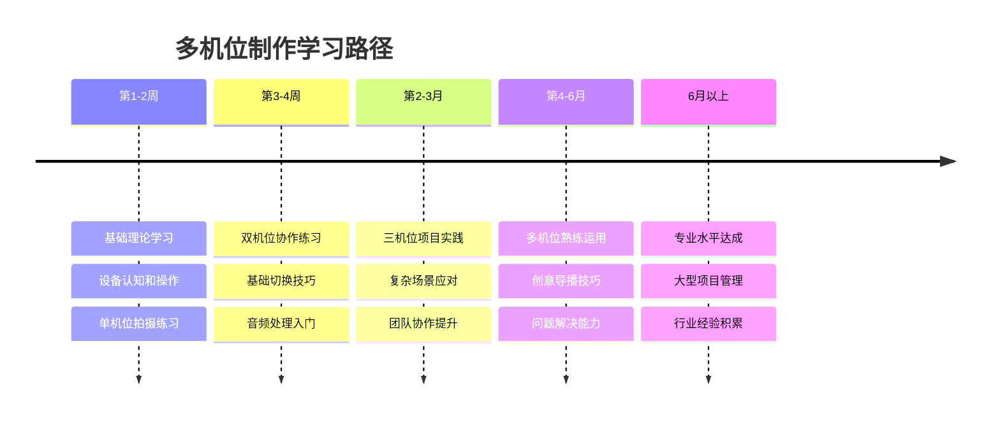

**技能掌握程度**

| 学习阶段 | 时间投入 | 技能水平 | 可承接项目 |
|----------|----------|----------|------------|
| **入门级** | 1-2 周 | 基础操作 | 简单录制 |
| **初级** | 1-2 月 | 基本切换 | 小型直播 |
| **中级** | 3-6 月 | 熟练运用 | 中型活动 |
| **高级** | 6 月 + | 专业水平 | 大型制作 |

**加速学习建议**
- 参加专业培训课程
- 寻找实习或志愿机会
- 观看大量优秀作品
- 与行业专家交流

:::

::: details Q5: 设备故障率高吗？如何预防？

**设备可靠性统计**

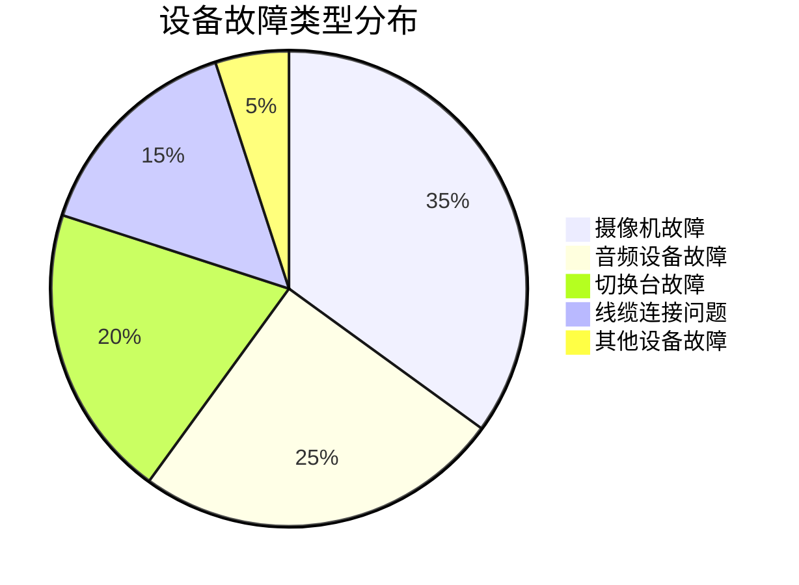

**故障预防体系**

| 预防层级 | 措施 | 效果 | 成本 |
|----------|------|------|------|
| **一级预防** | 定期维护保养 | 降低故障率 80% | 低 |
| **二级预防** | 使用前全面检查 | 发现潜在问题 90% | 中 |
| **三级预防** | 备用设备准备 | 故障影响降低 95% | 高 |

**应急响应流程**

```yaml
故障发现:
  - 立即报告导播
  - 启动应急预案
  - 记录故障信息

快速诊断:
  - 检查电源连接
  - 验证信号传输
  - 测试设备功能

应急处理:
  - 重启设备尝试
  - 更换连接线缆
  - 启用备用设备

恢复验证:
  - 确认功能正常
  - 测试信号质量
  - 继续正常制作
```

**设备维护清单**
- ✅ 每月清洁设备外观
- ✅ 每季度检查连接线缆
- ✅ 每半年专业保养
- ✅ 每年设备性能评估

:::

### 💰 成本问题

::: details Q6: 后期剪辑工作量大吗？如何优化？

**工作量分析**

```mermaid
sankey
    title 后期制作时间分配
    
    总时间,素材整理,30
    总时间,粗剪,25
    总时间,精剪,20
    总时间,调色,15
    总时间,音频处理,10
    
    素材整理,文件管理,15
    素材整理,同步对齐,15
    
    粗剪,内容筛选,15
    粗剪,结构搭建,10
    
    精剪,画面切换,12
    精剪,节奏调整,8
    
    调色,色彩校正,10
    调色,风格统一,5
    
    音频处理,降噪处理,5
    音频处理,混音输出,5
```

**效率优化策略**

| 优化方向 | 具体措施 | 效率提升 | 实施难度 |
|----------|----------|----------|----------|
| **前期规划** | 详细拍摄脚本 | 30% | 简单 |
| **现场标记** | 实时记录重点 | 40% | 简单 |
| **代理剪辑** | 低分辨率预览 | 50% | 中等 |
| **模板应用** | 标准化流程 | 35% | 中等 |
| **自动化工具** | AI 辅助剪辑 | 60% | 困难 |

**工具推荐**

::: code-group

```yaml [效率工具]
PluralEyes:
  功能: 自动音频同步
  效率提升: 节省 80% 同步时间
  价格: $199
  推荐度: ⭐⭐⭐⭐⭐

Proxy Media:
  功能: 代理文件生成
  效率提升: 剪辑速度提升 3 倍
  价格: 免费（内置功能）
  推荐度: ⭐⭐⭐⭐⭐

Frame.io:
  功能: 协作审片平台
  效率提升: 减少 50% 沟通时间
  价格: $15/月
  推荐度: ⭐⭐⭐⭐
```

```yaml [自动化方案]
AI剪辑助手:
  - 自动识别精彩片段
  - 智能画面切换建议
  - 音乐节拍自动对齐
  - 字幕自动生成

批处理脚本:
  - 批量文件重命名
  - 自动色彩校正
  - 统一输出格式
  - 批量上传分发
```

 **时间管理建议**
- 制定详细的后期时间表
- 分阶段完成，避免一次性处理
- 建立标准化的剪辑模板
- 培养高效的工作习惯

:::

---

> 📝 **文档说明**：本指南涵盖了多机位 EFP 制作的完整流程，从前期规划到后期制作的各个环节。建议根据实际项目需求和团队能力，灵活调整和应用相关内容。
> 
> 🔄 **持续更新**：随着技术发展和实践经验积累，本文档将持续更新优化，欢迎提供宝贵意见和建议。
