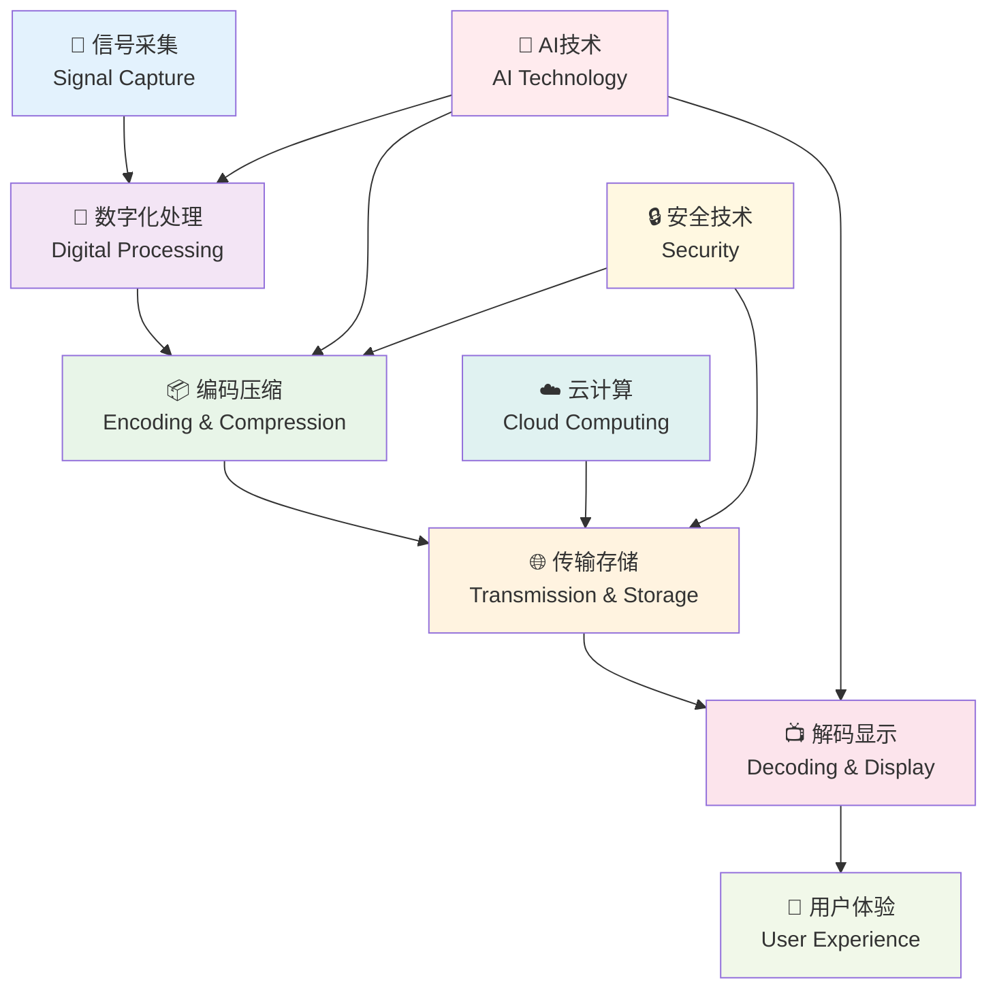

# 数字媒体技术 🔬

::: tip 数字媒体技术的前沿
**Digital Media Technology** 是现代信息技术与传统媒体的完美融合，代表着媒体技术发展的最前沿方向。
:::

## 🎯 概述

数字媒体技术是现代信息社会的核心技术之一，它不仅改变了我们获取和处理信息的方式，更重新定义了媒体内容的创作、传播和消费模式。从信号数字化的基础原理到人工智能的前沿应用，这个领域涵盖了技术创新的方方面面。

## 🏗️ 技术架构

::: info 完整的技术生态
数字媒体技术形成了一个完整的技术生态系统，每个环节都相互依存，共同构建现代媒体技术的基础。
:::

