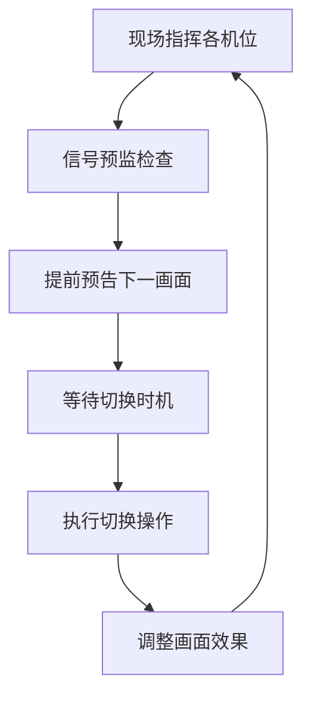

# 导播切换技术指南

## 一、导播切换的基本概念

导播切换是多机位制作中最核心的环节之一，指的是在现场或录制过程中，根据节目流程和画面需求，实时选择并切换不同摄像机信号，输出最终节目画面。

::: info 导播职责
导播员（Switcher/Director）通过切换台（Switcher/Mixer）操作，实现画面流畅衔接和内容重点突出，确保视觉连贯性和艺术表现力。
:::

## 二、切换方式详解

### 基础切换技术

| 切换方式 | 特点 | 适用场景 | 操作要点 |
|----------|------|----------|----------|
| **硬切（Cut）** | 直接切换，节奏紧凑 | 现场感强、节奏快的场合 | 选择合适的切换时机 |
| **淡入淡出（Fade/Dissolve）** | 画面逐渐叠化，过渡柔和 | 场景转换、情绪过渡 | 控制淡化时间长度 |
| **特效切换（Wipe/Effect）** | 图形动画特效，视觉冲击 | 综艺、晚会等节目 | 避免过度使用 |

::: tip 切换原则
- **节奏感**：切换要符合内容节奏
- **连贯性**：保持视觉逻辑连贯
- **目的性**：每次切换都要有明确目的
:::

## 三、导播工作流程

### 前期准备阶段

::: details 准备工作清单
**技术准备**：
- ✅ 与导演组、摄像、切换、字幕等岗位充分沟通
- ✅ 明确节目流程和画面需求
- ✅ 制定分镜头脚本
- ✅ 标注机位任务和切换时机

**设备准备**：
- ✅ 切换台参数配置
- ✅ 对讲系统建立
- ✅ 信号质量测试
:::

### 实时操作流程

### 质量控制

- **实时监控**：持续观察画面质量和切换效果
- **灵活调整**：根据现场情况调整切换策略
- **重点突出**：兼顾节奏与美感，突出重点内容

## 四、关键注意事项

### 技术标准

::: warning 技术要求
**必须满足的技术指标**：
- **信号稳定**：所有机位信号稳定可靠
- **画面连贯**：避免"跳轴"或突兀感
- **时间同步**：确保音视频同步
:::

| 注意事项 | 具体要求 | 解决方案 |
|----------|----------|----------|
| **画面连贯性** | 镜头运动方向、主体位置、景别变化合理 | 遵循180度轴线规则 |
| **节奏把控** | 根据音乐、表演、语速安排切换节奏 | 提前熟悉节目内容 |
| **信号安全** | 所有机位信号稳定，备用机位待命 | 建立应急预案 |
| **沟通协作** | 与各岗位保持实时沟通 | 建立有效对讲系统 |

### 应急预案

::: danger 安全保障
**必备应急措施**：
- 设备故障备用方案
- 信号中断应急处理
- 关键岗位人员备份
- 突发情况应对流程
:::

## 五、常用导播术语

导播在现场录制和切换过程中，需要与摄像、录音、切换等岗位高效沟通。以下为常用术语，按不同工种分组，并附中英文对照，便于实际操作时参考。

### 1. 常用摄像术语

#### 景别术语

| 中文术语 | 英文对照 | 应用场景 |
|----------|----------|----------|
| 最大远景 | Extreme long shot | 展现宏大场景，如体育场全景 |
| 远景 | Long shot | 展示人物与环境关系 |
| 全景、人全景 | Full shot | 完整展现人物全身及周围环境 |
| 中景 | Medium shot | 展现人物膝盖以上动作 |
| 膝上景 | Knee shot | 突出人物腰部以上互动 |
| 腰上景 | Waist shot | 访谈节目常用景别 |
| 半身景 | Bust shot | 主持人播报标准景别 |
| 近景 | Medium close up | 展示面部表情与手部动作 |
| 特写 | Close up | 突出人物面部表情 |
| 大特写 | Big close up | 强调眼睛、手指等局部细节 |
| 最大特写 | Extreme close up | 产品细节展示 |
| 过肩镜 | Over shoulder shot | 对话场景中展现人物关系 |
| 双人景 | 2-shot | 两人对话或互动 |
| 三人景 | 3-shot | 小组讨论场景 |
| 组团景 | Group shot | 4-6 人小群体场景 |
| 群体景 | Mob shot | 大型团队或观众全景 |

#### 摄像机操作术语

| 中文术语 | 英文对照 | 操作说明 |
|----------|----------|----------|
| 松景 | Loose shot | 扩大取景范围，包含更多环境 |
| 紧景 | Tight shot | 缩小取景范围，突出主体 |
| 俯角 | Low angle shot | 摄像机从低处向上拍摄，增强主体威严感 |
| 仰角 | High angle shot | 摄像机从高处向下拍摄，弱化主体 |
| 前移 | Dolly in | 摄像机向主体移动，产生空间压缩感 |
| 后退 | Dolly out | 摄像机远离主体，展现更多环境 |
| 左移 | Truck left | 摄像机横向向左移动 |
| 右移 | Truck right | 摄像机横向向右移动 |
| 左摇 | Pan left | 摄像机水平向左旋转 |
| 右摇 | Pan right | 摄像机水平向右旋转 |
| 抬头/上摇 | Tilt up | 摄像机垂直向上旋转 |
| 低头/下摇 | Tilt down | 摄像机垂直向下旋转 |
| 推 | Zoom in | 通过镜头焦距变化靠近主体 |
| 拉 | Zoom out | 通过镜头焦距变化远离主体 |
| 升高 | Pedestal up (ped. up) | 摄像机机位升高 |
| 降低 | Pedestal down (ped. down) | 摄像机机位降低 |
| 吊左/右、前/后 | Tongue left/right, Tongue in/out | 摇臂摄像机的移动控制 |

#### 画面调整术语

| 中文术语 | 英文对照 | 操作要点 |
|----------|----------|----------|
| 头上留天 | Head room | 人物头顶与画面顶部保留 1/10 画面高度的空间 |
| 脚下留地 | Foot room | 人物脚底与画面底部保留 1/15 画面高度的空间 |
| 对准焦点 | Focus up | 确保主体清晰，避免虚焦 |
| 调整画面 | Frame up | 重新构图以优化主体位置 |
| 演员入画 | Let actor in | 演员进入预定拍摄区域时的提示 |
| 演员出画 | Let actor out | 演员离开拍摄区域时的提示 |
| 跟随演员 (活动) | Take actor (across set) | 平滑跟随移动中的演员 |
| 跟随演员 (上台阶) | Take actor (up stairs) | 注意台阶高度变化的平稳过渡 |
| 准备演员起身 | Stand by for rise | 提前预告演员即将起身的动作 |

### 2. 常用音乐音效成音术语

| 中文术语 | 英文对照 | 使用示例 |
|----------|----------|----------|
| 试音量 | Sound level | "试 1 号麦音量" |
| 开麦克风 | Open boom/ Open mike | "开主持人麦" |
| 准备音乐 | Ready music/ Stand by music | 预告音乐即将播放 |
| 放音乐 | Hit music/Music in | 精确控制音乐开始时机 |
| 放音效 | Hit the sound effect | 配合动作播放音效 |
| 音乐轻起 | Sneak in music | 背景音乐缓慢进入 |
| 音乐停止 | Cut the music | 音乐立即终止 |
| 音乐渐消 | Fade out music/ Sneak out music | 情感段落结束时平滑过渡 |
| 音乐降低 | Music down | 主持人说话时降低背景音乐音量 |
| 音乐衬底 | Music to background | 保持背景音乐在最低可听水平 |
| 音乐声音增大 | Music up | 舞蹈段落音乐音量提升 |
| 音乐交叉 | Cross fade | 两首音乐无缝过渡 |

### 3. 常用视讯切换器操作术语

| 中文术语 | 英文对照 | 操作效果 |
|----------|----------|----------|
| 切 1 号 | Take one | 立即切换到 1 号机位 |
| 淡入 | Fade in | 画面从黑场逐渐显现 |
| 淡出 | Fade out | 画面逐渐变为黑场 |
| 叠化 | Dissolve/Mix | 前后画面重叠渐变过渡 |
| 划 | Wipe in/out | 新画面以几何图形方式覆盖旧画面 |
| 叠印 | Super | 将字幕或画面叠加在主画面上 |

> 以上术语为导播与各岗位沟通时的常用表达，实际口令通常为多个术语元素的组合。建议现场演练时多加熟悉和应用。

## 六、推荐实践

### 1. 实战案例分析

#### 苏州中学梦之队 20 周年舞蹈开放日转播

**项目背景**：2025 年元旦苏州中学梦之队舞蹈专场活动，采用 5 机位多讯道制作，实现线上线下同步直播

**核心切换策略**：
- 舞蹈表演采用「全景 - 中景 - 特写」递进式切换逻辑
- 团体舞使用 1 号全景机位与 2/3 号侧机位交叉切换
- 独舞段落采用 4 号斯坦尼康机位跟随 +5 号特写机位配合
- 转场处使用 0.5 秒快速叠化替代硬切，保持舞蹈连贯性

**关键经验**：
- 提前 72 小时完成分镜头脚本与摄像团队走位标注
- 导播台预设 8 组常用转场效果，根据舞蹈风格快速调用
- 建立「舞蹈高潮预警机制」，通过对讲系统提前 3 秒预告关键动作

[查看完整技术方案](https://szzxshumei.com/post/2025/shs-dt20-bt-retro-20250101/)

### 2. 操作建议

- **流程优化**：现场演练切换流程，重点排练开场、转场、高潮三个关键环节
- **文档记录**：使用时间码记录每次切换决策，标注当时的画面内容与切换理由
- **风格学习**：参考体育赛事（快节奏硬切）、音乐会（流畅叠化）、访谈节目（固定景别切换）的不同切换风格

> 导播切换不仅是技术操作，更是对节目内容和节奏的艺术把控。优秀的导播能让多机位画面有机融合，提升节目观赏性和专业度。

## 相关文档
- [机位设计](/guide/EFP/camera-layout)
- [收声方案](/guide/EFP/audio-capture-plan)
- [后期制作](/guide/EFP/post-production)
- [设备清单](/guide/EFP/equipment-list)
- [系统搭建](/guide/EFP/system-setup)
- [活动策划](/guide/EFP/event-planning)
- [EFP 案例](/guide/EFP/EFP-examples)
- [参考资料](/guide/EFP/reference-materials)

---

> 更多 EFP 导播切换案例可参考 [B 站 EFP 机位布置分析](https://www.bilibili.com/video/BV1Ya411u7ET/)