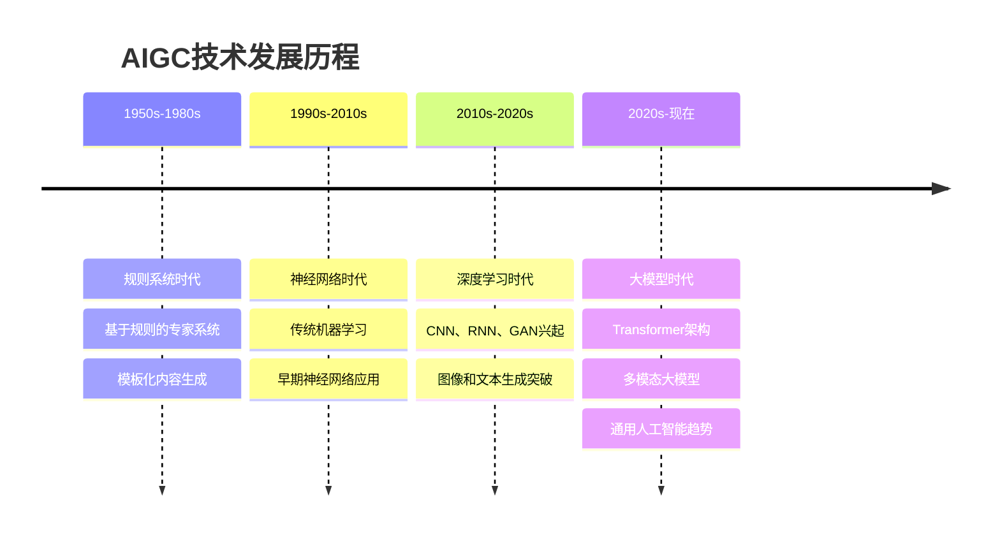
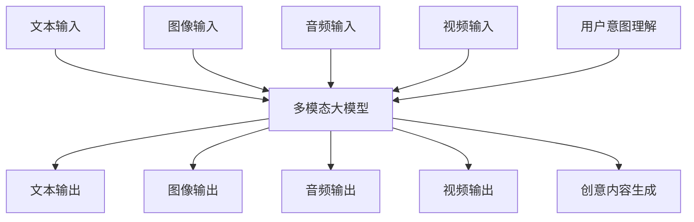
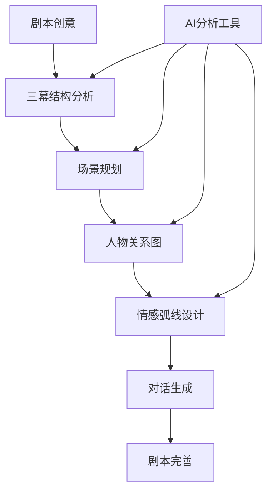
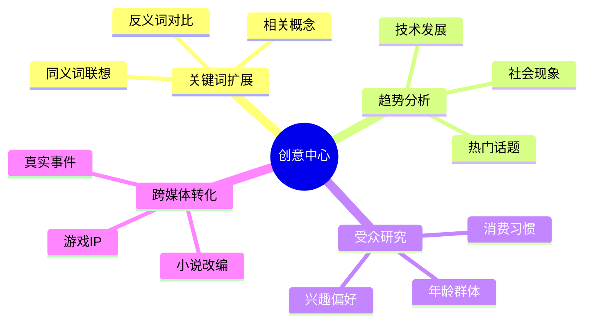
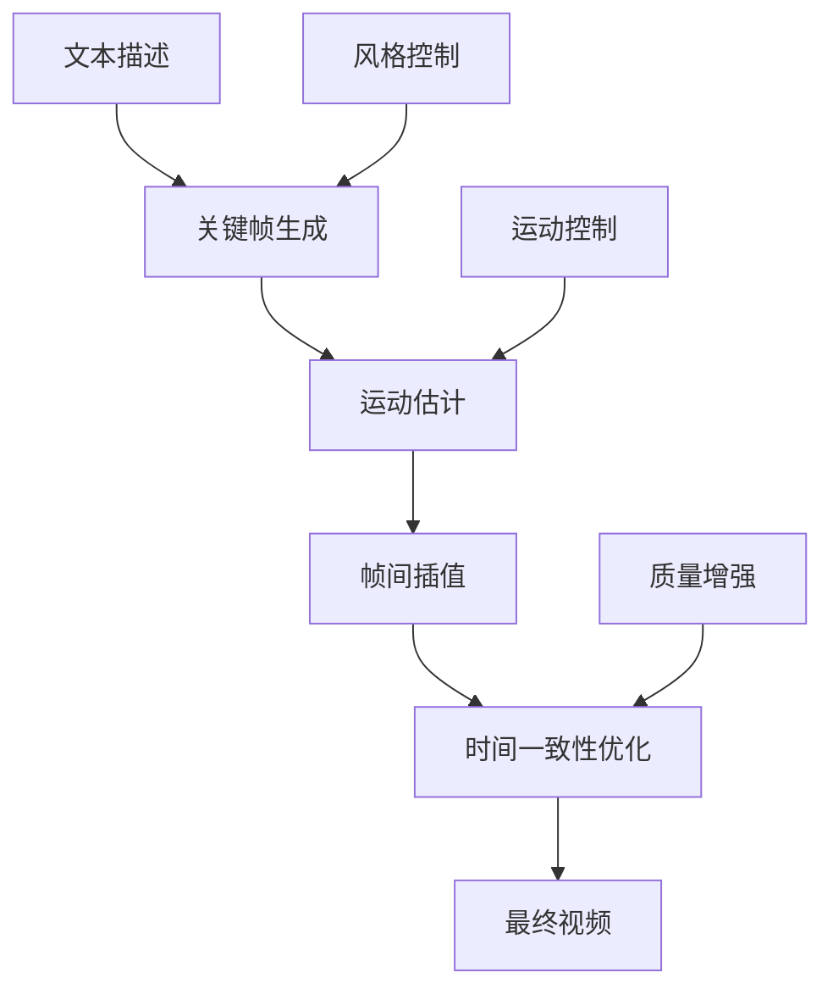
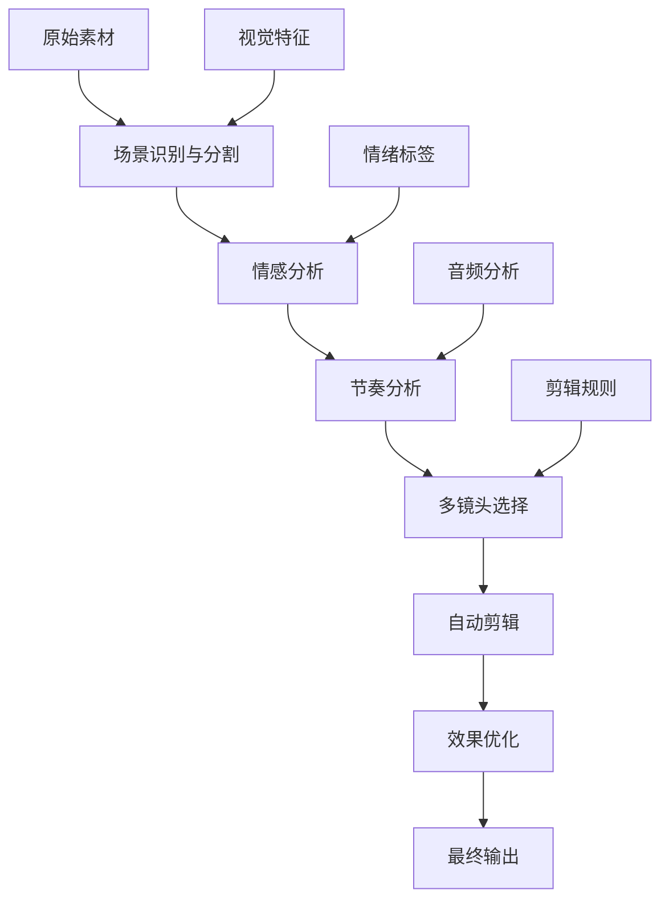
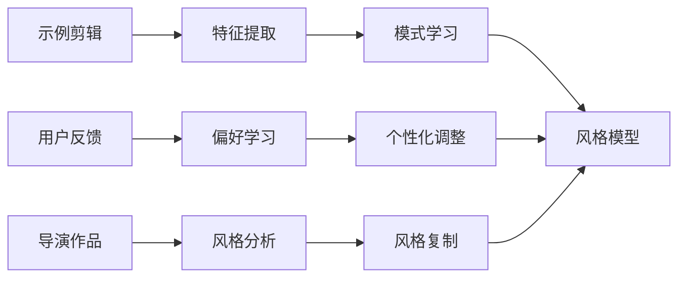

# AIGC 辅助技术

::: info 课程概览
本章深入探讨人工智能生成内容（AIGC）在数字媒体制作中的革命性应用，从 AI 剧本创作到智能剪辑，全面了解 AI 如何重塑创作流程。
:::

## 🎯 学习目标

- 🤖 理解 AIGC 的核心技术原理和发展趋势
- ✍️ 掌握 AI 辅助剧本创作和内容策划方法
- 🎨 学会使用 AI 工具生成视觉内容
- ✂️ 了解 AI 智能剪辑技术的应用场景
- 🚀 探索 AIGC 在影视制作中的未来可能性

## 1. AI 生成内容基础

### 1.1 AIGC 概述与定义

::: theorem AIGC 定义
**人工智能生成内容（AIGC, AI-Generated Content）**是指利用人工智能技术自主创作或辅助创作的各类媒体内容，包括文本、图像、音频、视频等多种形式。
:::

#### 🚀 发展历程



#### 📊 创作模式变革

| 传统创作模式 | AI 辅助创作模式 | 优势对比 |
|-------------|---------------|----------|
| 🎨 **纯人工创作** | 🤖 **人机协作** | 效率提升 10-100 倍 |
| ⏰ **线性流程** | 🔄 **迭代优化** | 快速试错和调整 |
| 💡 **经验依赖** | 📊 **数据驱动** | 突破个人局限性 |
| 🎯 **单一风格** | 🌈 **多样化探索** | 风格多元化 |

### 1.2 核心技术框架

#### 🧠 主要技术架构

::: code-group

```yaml [生成对抗网络 (GAN)]
原理: 生成器与判别器对抗训练
优势: 生成质量高，细节丰富
应用: 图像生成、风格迁移
代表: StyleGAN、CycleGAN
```

```yaml [扩散模型 (Diffusion)]
原理: 渐进去噪过程
优势: 稳定训练，高质量输出
应用: 图像生成、视频生成
代表: Stable Diffusion, DALL-E 2
```

```yaml [变分自编码器 (VAE)]
原理: 学习隐空间表示
优势: 可控生成，插值平滑
应用: 数据压缩、特征学习
代表: β-VAE、VQ-VAE
```

```yaml [大语言模型 (LLM)]
原理: Transformer 架构
优势: 理解和生成能力强
应用: 文本创作、多模态理解
代表: GPT-4、Claude、Gemini
```

:::

#### 🔄 技术融合趋势

::: info 多模态融合
现代 AIGC 系统越来越倾向于**多模态融合**，将文本、图像、音频、视频等不同模态的信息进行统一处理，实现更丰富的创作可能性。
:::



## 2. AI 剧本与内容策划

### 2.1 智能剧本生成

#### 📝 大语言模型在剧本创作中的应用

::: code-group

```yaml [剧本对话生成]
功能: 角色对话自动生成
优势: 保持角色一致性
技巧: 提供角色背景和语言风格
示例: "以莎士比亚风格写一段现代校园对话"
```

```yaml [情节构建]
功能: 故事情节发展
优势: 逻辑连贯，冲突合理
技巧: 设定明确的故事目标
示例: "设计一个关于时间旅行的悬疑情节"
```

```yaml [角色设定]
功能: 角色性格和背景
优势: 多维度角色塑造
技巧: 结合心理学理论
示例: "创建一个复杂的反派角色"
```

:::

#### 🏗️ 结构化写作辅助



::: example 剧本分析工具应用
**节奏评估**：分析场景转换频率和情绪起伏
- 慢节奏场景：对话密集，情感深入
- 快节奏场景：动作频繁，冲突激烈

**对话自然度评分**：评估对话的真实性和流畅性
- 语言风格一致性检查
- 角色声音区分度分析
:::

### 2.2 Prompt 工程最佳实践

#### 🎯 提示词构建方法

| 构建要素 | 说明 | 示例 | 效果 |
|----------|------|------|------|
| 🎭 **角色设定** | 明确 AI 扮演的角色 | "你是一位资深编剧" | 专业性提升 |
| 📋 **任务描述** | 清晰的任务指令 | "创作一个 5 分钟短片剧本" | 目标明确 |
| 🎨 **风格参考** | 指定创作风格 | "参考诺兰的叙事风格" | 风格统一 |
| ⚖️ **约束条件** | 限制和要求 | "适合青少年观众" | 内容合规 |

#### 🔗 链式推理技术

::: steps

1. **任务分解**
   - 将复杂剧本创作分解为多个步骤
   - 每个步骤专注于特定目标

2. **逐步执行**
   - 按顺序完成每个子任务
   - 前一步的输出作为下一步的输入

3. **结果整合**
   - 将各步骤结果组合
   - 进行最终的一致性检查

:::

::: tip Prompt 优化技巧
- 🔄 **迭代优化**：根据输出质量调整提示词
- 📊 **A/B 测试**：比较不同提示词的效果
- 🎯 **具体化**：避免模糊的描述，提供具体例子
- 🧠 **思维链**：引导 AI 展示推理过程
:::

### 2.3 内容策划与创意激发

#### 💡 创意头脑风暴系统



#### 📈 市场趋势分析

::: info AI 辅助趋势预测
通过分析社交媒体数据、搜索趋势、观看行为等，AI 可以帮助预测内容热点，为创作提供方向指导。
:::

| 分析维度 | 数据源 | AI 工具 | 应用价值 |
|----------|--------|--------|----------|
| 🔥 **热门话题** | 社交媒体 | 情感分析 | 把握时事热点 |
| 👥 **受众偏好** | 观看数据 | 推荐算法 | 精准定位 |
| 🎬 **类型趋势** | 票房数据 | 预测模型 | 类型选择 |
| 🌍 **地域特色** | 文化数据 | 本地化分析 | 区域适配 |

## 3. AI 视觉内容生成

### 3.1 AI 图像生成技术

#### 🎨 主流图像生成模型对比

| 模型 | 技术架构 | 优势 | 劣势 | 适用场景 |
|------|----------|------|------|----------|
| 🎭 **Stable Diffusion** | 扩散模型 | 开源、可控性强 | 需要技术基础 | 专业创作 |
| 🤖 **DALL-E 3** | 扩散+LLM | 文本理解好 | 闭源、成本高 | 商业应用 |
| 🎪 **Midjourney** | 扩散模型 | 艺术效果佳 | 控制有限 | 概念设计 |
| 🎯 **Adobe Firefly** | 扩散模型 | 商用安全 | 风格相对保守 | 商业设计 |

#### 🛠️ 图像编辑与操控技术

::: code-group

```yaml [ControlNet]
功能: 精确控制图像生成
原理: 条件控制扩散过程
应用: 姿态控制、边缘引导
优势: 高度可控，保持一致性
```

```yaml [InstructPix2Pix]
功能: 基于指令的图像编辑
原理: 文本指导的图像修改
应用: 局部编辑、风格调整
优势: 自然语言交互
```

```yaml [Inpainting]
功能: 图像修复和填充
原理: 基于上下文的内容生成
应用: 物体移除、背景替换
优势: 无缝融合
```

:::

#### 🎬 影视制作应用实例

::: example 概念设计工作流
**1. 初始概念生成**
- 提示词："未来城市，赛博朋克风格，霓虹灯，雨夜"
- 生成多个候选方案

**2. 风格一致性控制**
- 使用 ControlNet 保持建筑结构
- 应用统一的色彩 LUT

**3. 细节优化**
- 局部重绘提升质量
- 添加特定元素（logo、标识等）
:::

### 3.2 AI 视频生成技术

#### 📹 文本到视频模型



#### 🚀 主要视频生成模型

::: code-group

```yaml [Sora (OpenAI)]
特点: 长时间一致性
时长: 最长 60 秒
分辨率: 1080p
优势: 物理规律遵循好
```

```yaml [Gen-2 (Runway)]
特点: 商业化程度高
时长: 4-18 秒
分辨率: 720p-1080p
优势: 用户界面友好
```

```yaml [Pika Labs]
特点: 社区驱动
时长: 3-4 秒
分辨率: 720p
优势: 免费使用
```

:::

#### 🎞️ 图像动画化技术

::: steps

1. **静态图像分析**
   - 深度估计
   - 对象分割
   - 运动预测

2. **运动场生成**
   - 光流计算
   - 3D 运动建模
   - 物理约束

3. **帧序列生成**
   - 中间帧插值
   - 时间一致性保证
   - 质量优化

:::

### 3.3 技术局限与解决方案

#### ⚠️ 主要技术挑战

| 问题类型 | 具体表现 | 影响程度 | 解决方案 |
|----------|----------|----------|----------|
| ⏰ **时间一致性** | 帧间闪烁、物体变形 | 高 | 时序约束、参考帧 |
| 🏗️ **物理规律** | 不合理运动、重力违背 | 中 | 物理引擎集成 |
| 🎯 **细节控制** | 无法精确指定细节 | 中 | 多层次控制 |
| ⚖️ **版权风险** | 训练数据版权问题 | 高 | 合规数据集 |

#### 🛡️ 版权安全策略

::: warning 版权合规建议

**🔍 使用前检查**
- 选择商用安全的模型
- 避免生成知名 IP 内容
- 检查输出是否侵权

**📋 使用规范**
- 建立内部使用指南
- 记录生成过程和来源
- 定期更新合规政策

**🛠️ 技术措施**
- 使用水印检测工具
- 建立内容审核流程
- 保留生成记录

:::

::: tip 质量提升技巧
- 🎯 **精确提示词**：使用具体、详细的描述
- 🔄 **迭代优化**：多次生成选择最佳结果
- 🎨 **风格参考**：提供参考图像或风格描述
- ⚙️ **参数调优**：调整生成参数获得理想效果
:::

## 4. AI 智能剪辑技术

### 4.1 自动剪辑系统

#### 🎬 核心功能模块



#### 🔍 场景识别与分割技术

::: code-group

```yaml [视觉特征分析]
技术: 深度学习 CNN
功能: 识别场景变化
指标: 颜色直方图、边缘特征
精度: >95% 准确率
```

```yaml [音频特征分析]
技术: 音频信号处理
功能: 检测音频变化
指标: 频谱分析、音量变化
应用: 对话场景分割
```

```yaml [时间特征分析]
技术: 时序模型
功能: 预测剪切点
指标: 镜头长度统计
优势: 符合观看习惯
```

:::

#### 💭 情感分析驱动剪辑

| 情感类型 | 剪辑特点 | 镜头长度 | 转场方式 | 音乐匹配 |
|----------|----------|----------|----------|----------|
| 😊 **快乐** | 快节奏剪切 | 2-4 秒 | 快切、跳切 | 明快音乐 |
| 😢 **悲伤** | 慢节奏剪切 | 6-10 秒 | 淡入淡出 | 抒情音乐 |
| 😨 **紧张** | 不规则剪切 | 1-3 秒 | 硬切、闪切 | 紧张音效 |
| 🤔 **思考** | 稳定剪切 | 5-8 秒 | 溶解 | 轻音乐 |

### 4.2 剪辑辅助工具

#### 🗣️ 智能语音处理

::: steps

1. **语音识别**
   - 多语言支持
   - 方言识别
   - 噪声过滤

2. **时间码匹配**
   - 精确到帧级别
   - 自动同步校正
   - 多轨道支持

3. **字幕生成**
   - 自动断句
   - 样式应用
   - 位置优化

:::

#### 🏷️ 内容标记与检索

::: example 智能标记系统
**自动标记类型**：
- 🎭 **人物标记**：识别出现的人物
- 📍 **场景标记**：室内/室外、具体地点
- 🎬 **镜头标记**：特写/中景/远景
- 🎨 **情绪标记**：快乐/悲伤/紧张
- 🏃 **动作标记**：静态/运动/快速运动

**检索功能**：
- 快速定位特定内容
- 批量处理相似镜头
- 智能推荐相关素材
:::

### 4.3 个性化剪辑模型

#### 🧠 模型训练方法



#### 🎯 垂直领域应用

| 内容类型 | 剪辑特点 | 关键指标 | 专用功能 |
|----------|----------|----------|----------|
| 📰 **新闻** | 信息密度高 | 准确性、时效性 | 要点提取 |
| 🎵 **音乐 MV** | 节拍同步 | 音画同步率 | 节拍检测 |
| 🎮 **游戏视频** | 高光时刻 | 精彩度评分 | 操作识别 |
| 📚 **教育内容** | 逻辑清晰 | 理解度 | 知识点分割 |

::: tip 个性化训练建议
- 📊 **数据收集**：收集足够的示例剪辑
- 🔄 **迭代优化**：根据反馈不断调整
- 🎯 **目标明确**：定义清晰的风格目标
- 📈 **效果评估**：建立客观评价标准
:::

## 5. AI 创作实践与未来发展
- **实际工作流程整合**：
  - **混合工作流**：AI 与人工创作的结合点
  - **质量控制机制**：AI 输出的人工审核流程
  - **版本迭代策略**：基于反馈的 AI 结果优化
  - **资源分配优化**：在何处使用 AI 以最大化效益
- **行业应用案例分析**：
  - **内容营销**：短视频批量智能生成
  - **电影前期可视化**：概念设计与分镜快速生成
  - **游戏资产创建**：NPC 对话与场景素材生成
  - **多语言本地化**：配音与口型同步自动化
- **未来趋势与挑战**：
  - **个人风格 AI 助手**：学习创作者风格的定制模型
  - **实时协同创作**：人机交互式创意开发
  - **端到端内容流水线**：从概念到成品的全流程 AI 支持
  - **伦理与原创性讨论**：AI 创作的版权与价值定位

## 相关资源
- [AIGC 在影视制作中的应用白皮书](https://www.example.com)
- [Prompt 工程高级技巧指南](https://www.example.com)
- [AI 模型选择与部署最佳实践](https://www.example.com)
