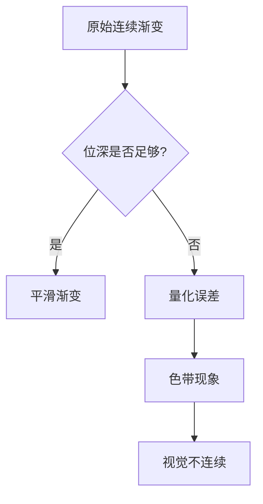
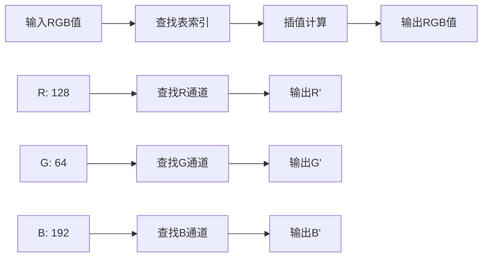
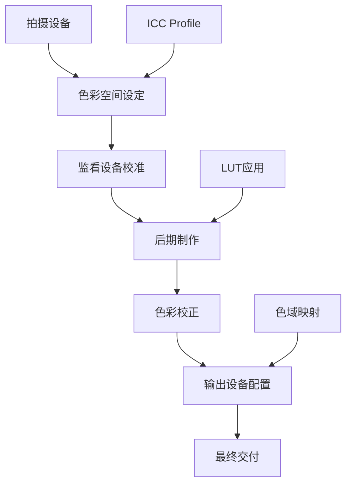

# 色彩科学核心

::: info 课程概览
本章将深入探讨数字媒体制作中的色彩科学基础，包括色域标准、色深原理、LUT 数学模型和色彩管理工作流。这些知识对于确保影视作品的色彩准确性和一致性至关重要。
:::

## 🎯 学习目标

- 🌈 理解不同色域标准的特点和应用场景
- 🎨 掌握色深对色彩表现的影响
- 🔧 学会 LUT 的工作原理和应用方法
- 📐 建立完整的色彩管理工作流

## 1. 色域标准

### 1.1 色彩空间基础概念

色域（Color Gamut）是指一个显示或记录设备能够再现的所有色彩的集合，通常在 CIE 色度图上表示为一个三角形或多边形区域。

::: details 色彩空间的数学表示
色彩空间通过三个基色的坐标来定义：
- **红色基色 (R)**：(xr, yr)
- **绿色基色 (G)**：(xg, yg)  
- **蓝色基色 (B)**：(xb, yb)
- **白点 (W)**：(xw, yw)
:::

### 1.2 主要色域标准对比

#### 📊 色域覆盖范围对比

| 色域标准 | 覆盖范围 | 主要应用 | 特点 | 兼容性 |
|----------|----------|----------|------|--------|
| 🌐 **sRGB** | ~35% | 网页、消费级设备 | 标准化程度高 | ⭐⭐⭐⭐⭐ |
| 📺 **Rec.709** | ~35% | HDTV 广播 | 与 sRGB 相近，gamma 不同 | ⭐⭐⭐⭐ |
| 🎬 **DCI-P3** | ~45% | 数字电影放映 | 红绿色彩更丰富 | ⭐⭐⭐ |
| 🔮 **Rec.2020** | ~75% | 4K/8K超高清 | 最广色域 | ⭐⭐ |

#### 🎯 应用场景选择指南

::: code-group

```yaml [网络发布]
推荐: sRGB
原因: 最佳兼容性
注意: 确保在 sRGB 监视器上调色
```

```yaml [电视广播]
推荐: Rec.709
原因: 广播标准
注意: 注意 gamma 曲线差异
```

```yaml [电影制作]
推荐: DCI-P3
原因: 影院标准
注意: 红绿色彩表现更佳
```

```yaml [未来制作]
推荐: Rec.2020
原因: 最广色域
注意: 需要专业设备支持
```

:::

::: warning 色域转换注意事项
- 从大色域转换到小色域会丢失色彩信息
- 不同色域间的转换需要专业 LUT
- 监看设备的色域必须与制作标准匹配
:::

## 2. 色深原理

### 2.1 位深与色彩精度

::: info 位深基础概念
**位深（Bit Depth）**决定了每个颜色通道可以表示的色阶数量，直接影响色彩的精细程度和过渡的平滑性。
:::

#### 📊 常见位深对比

| 位深 | 每通道色阶 | 总色彩数 | 应用场景 | 文件大小 |
|------|------------|----------|----------|----------|
| 🎨 **8bit** | 256 级 | ~1677 万色 | 网络发布、消费级 | 基准 |
| 🎬 **10bit** | 1024 级 | ~10 亿色 | 专业制作、广播 | 1.25 倍 |
| 💎 **12bit** | 4096 级 | ~687 亿色 | 高端制作、RAW | 1.5 倍 |
| 🔮 **16bit** | 65536 级 | ~281 万亿色 | 极致后期处理 | 2 倍 |

::: details 色彩数量计算公式
**总色彩数** = (2^位深)^3

例如：8bit = (2^8)^3 = 256^3 = 16,777,216 ≈ 1677 万色
:::

### 2.2 色带现象分析

::: danger 色带问题
**色带（Banding）** 是指在色彩渐变区域出现的不连续色块，主要由位深不足引起。
:::

#### 🔍 色带产生原因



#### 🛠️ 色带解决方案

| 方法 | 原理 | 效果 | 适用场景 |
|------|------|------|----------|
| 🔧 **提升位深** | 增加色阶数量 | ⭐⭐⭐⭐⭐ | 前期拍摄 |
| 🎭 **加抖处理** | 添加随机噪声 | ⭐⭐⭐⭐ | 后期处理 |
| 🌊 **渐变优化** | 调整渐变曲线 | ⭐⭐⭐ | 创意调色 |

### 2.3 HDR 与色深关系

::: theorem HDR 色深需求
**高动态范围（HDR）**图像需要更高的位深来表现从极暗到极亮的细节，通常要求 10bit 以上。
:::

#### 📈 HDR 标准对比

::: code-group

```yaml [HDR10]
位深: 10bit
色域: Rec.2020
亮度: 1000 nits
应用: 消费级 HDR
```

```yaml [Dolby Vision]
位深: 12bit
色域: Rec.2020
亮度: 4000+ nits
应用: 专业 HDR
```

```yaml [HLG]
位深: 10bit
色域: Rec.2020
亮度: 1000 nits
应用: 广播 HDR
```

:::

::: tip HDR 制作建议
- 🎯 **拍摄**：使用 10bit 以上记录格式
- 🖥️ **监看**：配备 HDR 监视器
- 🔄 **工作流**：保持 HDR 色彩空间一致性
:::

## 3. LUT 数学模型

### 3.1 LUT 工作原理

::: theorem LUT 定义
**LUT（Look-Up Table）**是一种通过预计算的查找表进行色彩映射转换的技术，将输入色彩值映射到输出色彩值。
:::

#### 🔄 LUT 映射过程



::: details 数学表示
对于输入色彩值 (R, G, B)，LUT 转换可表示为：

$$f(R, G, B) = (R', G', B')$$

其中 f 是由 LUT 定义的映射函数。
:::

### 3.2 LUT 类型分类

#### 🎯 按功能分类

::: code-group

```yaml [技术LUT]
用途: 色彩空间转换、设备校准
特点: 数学精确、标准化
示例: sRGB 到 Rec.709 转换
重要性: 确保色彩准确性
```

```yaml [创意LUT]
用途: 艺术风格、视觉表现
特点: 主观审美、风格化
示例: 电影调色风格
重要性: 提升视觉效果
```

:::

#### 📐 按维度分类

##### 1D LUT vs 3D LUT

| 特性 | 1D LUT | 3D LUT |
|------|--------|--------|
| 🎯 **处理方式** | 分别处理 RGB 通道 | 同时处理 RGB 组合 |
| ⚡ **性能** | 快速 | 较慢 |
| 🎨 **精度** | 有限 | 高精度 |
| 💾 **存储** | 小 | 大 |
| 🔧 **适用场景** | 简单调整 | 复杂色彩转换 |

::: example 1D LUT 示例
**Gamma 校正**：将线性 RGB 值转换为显示设备所需的非线性值

输入：R=128 → 查表 → 输出：R'=186

每个通道独立处理，无法处理通道间的色彩交互。
:::

::: example 3D LUT 示例
**色彩空间转换**：将 DCI-P3 色彩转换为 sRGB

输入：(R=200, G=100, B=50) → 3D 查表 → 输出：(R'=180, G'=95, B'=55)

考虑 RGB 三个通道的相互影响，实现精确的色彩映射。
:::

### 3.3 LUT 尺寸与精度

#### 📊 常见 LUT 尺寸

| LUT 尺寸 | 节点数 | 精度 | 文件大小 | 应用场景 |
|---------|--------|------|----------|----------|
| 🔸 **17³** | 4,913 | 中等 | ~150KB | 实时预览 |
| 🔹 **33³** | 35,937 | 高 | ~1MB | 专业调色 |
| 🔺 **65³** | 274,625 | 极高 | ~8MB | 精密转换 |

::: tip LUT 尺寸选择建议
- 🎬 **实时预览**：17³或 33³，平衡性能与质量
- 🎯 **最终渲染**：33³或 65³，追求最佳质量
- 📱 **移动设备**：17³，考虑性能限制
:::

## 4. 色彩管理工作流

### 4.1 色彩管理基础概念

::: info 色彩管理定义
**色彩管理（Color Management）**是确保从拍摄、制作到输出的全流程中色彩保持一致性和准确性的技术体系。
:::

#### 🔄 色彩管理工作流程



### 4.2 设备校准流程

#### 🖥️ 监视器校准步骤

::: steps

1. **预热设备**
   - 监视器预热 30 分钟以上
   - 确保环境光线稳定

2. **设置目标参数**
   - 亮度：100-120 cd/m²
   - 色温：D65 (6500K)
   - Gamma：2.4 (视频) / 2.2 (图像)

3. **使用校色仪**
   - 连接硬件校色设备
   - 运行校准软件
   - 生成 ICC 配置文件

4. **验证校准结果**
   - 检查色彩准确性
   - 测试灰阶过渡
   - 验证色域覆盖

:::

#### 📊 校准设备对比

| 设备类型 | 精度 | 价格 | 适用场景 | 推荐品牌 |
|----------|------|------|----------|----------|
| 🎯 **入门级** | 中等 | ¥500-1500 | 基础校准 | X-Rite i1Display |
| 🎬 **专业级** | 高 | ¥3000-8000 | 专业制作 | X-Rite i1Pro |
| 💎 **顶级** | 极高 | ¥15000+ | 广播级 | Klein K10-A |

### 4.3 常见问题与解决方案

#### 🚨 典型色彩管理错误

::: danger 常见错误类型

**1. 监视器未校准**
- 症状：色彩偏差、亮度不准
- 解决：定期校准，建立校准计划

**2. 色彩空间混乱**
- 症状：色彩饱和度异常
- 解决：统一工作流色彩空间

**3. 输出设备不匹配**
- 症状：最终输出与预期不符
- 解决：针对目标设备优化

:::

#### 🛠️ 问题诊断流程

| 问题现象 | 可能原因 | 检查方法 | 解决方案 |
|----------|----------|----------|----------|
| 🎨 **色彩偏移** | 监视器漂移 | 重新校准 | 定期校准计划 |
| 📺 **亮度异常** | 环境光影响 | 光线测量 | 控制环境光 |
| 🌈 **色域不匹配** | 设备限制 | 色域测试 | 更换设备/软件补偿 |

### 4.4 实践建议

::: tip 色彩管理最佳实践

**🎯 设备管理**
- 定期校准监视器（每月一次）
- 记录设备使用时间和校准历史
- 建立设备更换计划

**📐 工作流规范**
- 统一团队色彩空间标准
- 建立标准作业程序（SOP）
- 培训团队成员色彩管理知识

**🔍 质量控制**
- 使用标准测试图像验证
- 建立色彩质量检查清单
- 记录和分析色彩问题

:::

## 5. 总结

::: success 核心要点
色彩科学是数字媒体制作的重要基础，涵盖色域标准、色深原理、LUT 技术和色彩管理等多个方面。掌握这些知识有助于确保作品的色彩质量和一致性。
:::

::: info 实践价值
对于苏州中学树莓社的影视制作而言，建立规范的色彩管理工作流程，不仅能提升作品的专业水准，更能为团队的技术能力建设奠定坚实基础。
:::

## 相关资源

::: details 📚 延伸阅读
- [CIE 色彩空间标准文档](https://cie.co.at/)
- [ITU-R 广播标准](https://www.itu.int/rec/R-REC/)
- [SMPTE 专业标准](https://www.smpte.org/)
- [色彩管理联盟资源](https://www.color.org/)
:::

