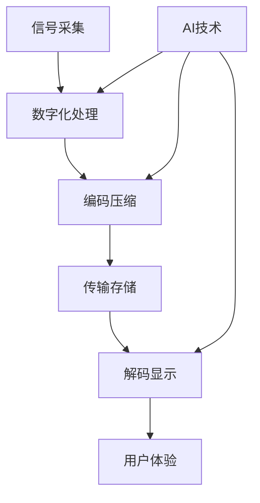

# 数字媒体技术 🔬

## 概述

数字媒体技术是现代信息技术与传统媒体相结合的产物，涵盖了从信号数字化、编解码算法到传输协议、显示技术等多个技术领域。本板块深入探讨数字媒体技术的核心原理、前沿发展和实际应用。

## 技术架构

## 核心技术领域

### 基础理论
- [信号数字化原理](./01-principles-of-signal-digitization.md) - 模拟信号到数字信号的转换
- [核心色彩科学](./02-core-color-science.md) - 色彩空间、色域和色彩管理
- [时码与同步技术](./03-timecode-and-synchronization-technologies.md) - 时间基准和同步机制

### 存储与显示
- [存储架构与性能](./04-storage-architecture-and-performance.md) - 存储系统设计和优化
- [显示技术与校准](./05-display-technologies-and-calibration.md) - 显示设备原理和色彩校准
- [采集设备技术分析](./06-capture-device-technology-analysis.md) - 摄像设备技术原理

### 编解码技术
- [视频编码算法](./07-video-encoding-algorithms.md) - H.264、H.265、AV1等编码标准
- [容器格式设计](./08-container-format-design.md) - MP4、MOV、MKV等封装格式
- [流媒体传输系统](./09-streaming-media-transmission-systems.md) - 网络传输协议和优化

### 新兴技术
- [交互式视频技术](./10-interactive-video-technologies.md) - 互动媒体和用户交互
- [AR/VR技术架构](./11-ar-vr-technical-architecture.md) - 增强现实和虚拟现实技术
- [虚拟制作技术](./12-virtual-production-technologies.md) - 实时渲染和虚拟拍摄

### AI与智能化
- [AIGC辅助技术](./13-aigc-assistant-technologies.md) - AI生成内容和智能辅助
- [修复与增强技术](./14-restoration-and-enhancement-technologies.md) - 视频修复和画质增强
- [虚拟人技术系统](./15-virtual-human-technology-systems.md) - 数字人和虚拟角色技术

### 标准与安全
- [行业技术标准](./16-industry-technical-standards.md) - 国际标准和行业规范
- [版权与加密技术](./17-copyright-and-encryption-technologies.md) - 内容保护和数字版权
- [容灾与备份方案](./18-disaster-recovery-and-backup-solutions.md) - 数据安全和灾难恢复

## 应用场景

### 传统媒体
- 📺 **广播电视**：数字电视、IPTV、OTT平台
- 🎬 **影视制作**：数字电影、后期制作、特效合成
- 📻 **音频媒体**：数字广播、音频流媒体

### 新兴应用
- 🎮 **游戏娱乐**：实时渲染、云游戏、元宇宙
- 🏥 **医疗影像**：医学图像处理、远程诊断
- 🏫 **在线教育**：远程教学、虚拟实验室
- 🏭 **工业应用**：数字孪生、工业视觉检测

## 技术发展趋势

### 编解码技术
- **下一代编码**：VVC/H.266、AV1优化
- **AI编码**：神经网络编码、感知编码
- **实时编码**：低延迟编码、边缘计算

### 显示技术
- **高动态范围**：HDR10+、Dolby Vision
- **高刷新率**：120Hz、240Hz显示
- **新型显示**：MicroLED、全息显示

### 传输技术
- **5G/6G应用**：超低延迟传输、边缘计算
- **云端处理**：云渲染、云编码服务
- **区块链**：去中心化存储、版权保护

## 学习路径

### 初级阶段
1. 掌握数字信号基础理论
2. 了解常见编解码标准
3. 学习基本的色彩科学知识

### 中级阶段
1. 深入理解编码算法原理
2. 掌握存储和传输技术
3. 学习显示技术和校准方法

### 高级阶段
1. 研究前沿AI技术应用
2. 掌握虚拟制作技术
3. 了解行业标准和发展趋势

## 技术价值

🎯 **技术创新**：推动媒体技术不断发展和突破  
🎯 **产业升级**：促进传统媒体向数字化转型  
🎯 **用户体验**：提供更优质的视听体验  
🎯 **效率提升**：通过技术手段提高制作效率  

---

*数字媒体技术是连接创意与实现的桥梁，掌握这些核心技术将帮助您在数字媒体时代中把握机遇，创造价值。*