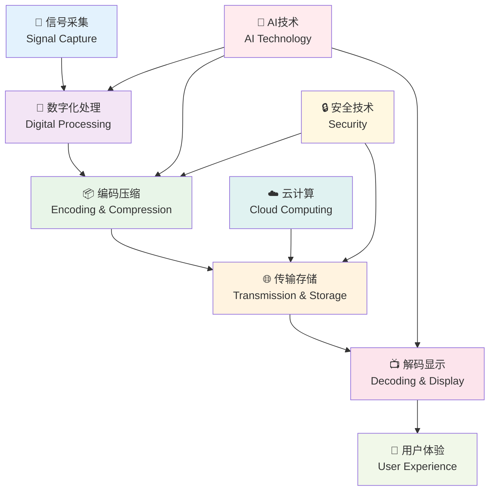

# 数字媒体技术 🔬

::: tip 数字媒体技术的前沿
**Digital Media Technology** 是现代信息技术与传统媒体的完美融合，代表着媒体技术发展的最前沿方向。
:::

## 🎯 概述

数字媒体技术是现代信息社会的核心技术之一，它不仅改变了我们获取和处理信息的方式，更重新定义了媒体内容的创作、传播和消费模式。从信号数字化的基础原理到人工智能的前沿应用，这个领域涵盖了技术创新的方方面面。

## 🏗️ 技术架构

::: info 完整的技术生态
数字媒体技术形成了一个完整的技术生态系统，每个环节都相互依存，共同构建现代媒体技术的基础。
:::

## 📚 核心技术领域

### 🔬 基础理论

::: info 理论基础的重要性
扎实的理论基础是掌握数字媒体技术的前提，理论指导实践，实践验证理论。
:::

- 📊 [信号数字化原理](./01-principles-of-signal-digitization.md) - 模拟信号到数字信号的转换
- 🌈 [核心色彩科学](./02-core-color-science.md) - 色彩空间、色域和色彩管理
- ⏰ [时码与同步技术](./03-timecode-and-synchronization-technologies.md) - 时间基准和同步机制

### 💾 存储与显示

::: tip 硬件技术的发展
存储和显示技术的进步直接推动了整个数字媒体行业的发展。
:::

- 🗄️ [存储架构与性能](./04-storage-architecture-and-performance.md) - 存储系统设计和优化
- 📺 [显示技术与校准](./05-display-technologies-and-calibration.md) - 显示设备原理和色彩校准
- 📷 [采集设备技术分析](./06-capture-device-technology-analysis.md) - 摄像设备技术原理

### 🔄 编解码技术

::: warning 编解码的核心地位
编解码技术是数字媒体技术的核心，直接影响内容质量、传输效率和用户体验。
:::

- 🎬 [视频编码算法](./07-video-encoding-algorithms.md) - H.264、H.265、AV1 等编码标准
- 📦 [容器格式设计](./08-container-format-design.md) - MP4、MOV、MKV 等封装格式
- 🌐 [流媒体传输系统](./09-streaming-media-transmission-systems.md) - 网络传输协议和优化

### 🚀 新兴技术

#### 🎮 交互式媒体
- 🎯 [交互式视频技术](./10-interactive-video-technologies.md) - 互动媒体和用户交互
- 🕶️ [AR/VR 技术架构](./11-ar-vr-technical-architecture.md) - 增强现实和虚拟现实技术

#### 🎭 虚拟制作
- 🎬 [虚拟制作技术](./12-virtual-production-technologies.md) - 实时渲染和虚拟拍摄
- 🌍 [元宇宙技术基础](./12-1-metaverse-foundations.md) - 虚拟世界构建技术

### 🤖 AI 与智能化

::: tip AI 技术的革命性影响
AI 技术正在重塑数字媒体行业，从内容生成到智能分析，AI 无处不在。
:::

#### 🎨 内容生成
- 🖼️ [AIGC 辅助技术](./13-aigc-assistant-technologies.md) - AI 生成内容和智能辅助
- 🎭 [虚拟人技术系统](./15-virtual-human-technology-systems.md) - 数字人和虚拟角色技术

#### 🔧 智能处理
- ✨ [修复与增强技术](./14-restoration-and-enhancement-technologies.md) - 视频修复和画质增强
- 🧠 [智能分析技术](./14-1-intelligent-analysis.md) - 内容理解和自动标注

### 🛡️ 标准与安全

- 📏 [行业技术标准](./16-industry-technical-standards.md) - 国际标准和行业规范
- 🔒 [版权与加密技术](./17-copyright-and-encryption-technologies.md) - 内容保护和数字版权
- 🛡️ [容灾与备份方案](./18-disaster-recovery-and-backup-solutions.md) - 数据安全和灾难恢复

## 🌍 应用场景

::: details 点击查看详细应用领域

### 📺 传统媒体

#### 📡 广播电视
- 📺 数字电视广播系统
- 🌐 IPTV 网络电视平台
- 📱 OTT 流媒体服务
- 🎯 个性化推荐系统

#### 🎬 影视制作
- 🎥 数字电影制作流程
- ✨ 视觉特效与合成
- 🎨 数字调色与后期
- 🎭 虚拟角色制作

#### 📻 音频媒体
- 📡 数字广播技术
- 🎵 高保真音频流媒体
- 🎧 空间音频技术
- 🎼 AI 音乐生成

### 🚀 新兴应用

#### 🎮 游戏娱乐
- 🕹️ 实时渲染技术
- ☁️ 云游戏平台
- 🌍 元宇宙虚拟世界
- 🎯 沉浸式体验设计

#### 🏥 医疗影像
- 🔬 医学图像处理
- 🩺 远程诊断系统
- 🧠 AI 辅助诊断
- 📊 医疗数据可视化

#### 🏫 在线教育
- 💻 远程教学平台
- 🔬 虚拟实验室
- 📚 交互式学习内容
- 🎓 个性化学习路径

#### 🏭 工业应用
- 🔧 数字孪生技术
- 👁️ 工业视觉检测
- 🤖 智能制造系统
- 📈 数据可视化分析

:::

## 🔮 技术发展趋势

::: tip 技术演进方向
数字媒体技术正在经历前所未有的快速发展，新技术不断涌现，推动行业持续创新。
:::

### 🎬 编解码技术

#### 📈 下一代编码
- **VVC/H.266**：50% 压缩效率提升
- **AV1 优化**：开源编码标准普及
- **LCEVC**：增强型编码技术

#### 🤖 AI 编码
- **神经网络编码**：基于深度学习的压缩
- **感知编码**：人眼视觉优化编码
- **自适应编码**：内容感知的智能编码

#### ⚡ 实时编码
- **低延迟编码**：毫秒级延迟优化
- **边缘计算**：就近处理减少延迟
- **硬件加速**：专用芯片优化

### 📺 显示技术

#### 🌈 高动态范围
- **HDR10+**：动态元数据优化
- **Dolby Vision**：端到端 HDR 解决方案
- **HDR Vivid**：中国自主 HDR 标准

#### ⚡ 高刷新率
- **120Hz/240Hz**：超流畅显示体验
- **可变刷新率**：VRR 技术普及
- **低延迟显示**：游戏专用优化

#### 🔬 新型显示
- **MicroLED**：下一代显示技术
- **全息显示**：三维立体显示
- **透明显示**：AR 应用场景

### 🌐 传输技术

#### 📡 5G/6G应用
- **超低延迟**：1ms 以下传输延迟
- **边缘计算**：MEC 移动边缘计算
- **网络切片**：专用网络资源

#### ☁️ 云端处理
- **云渲染**：GPU 云服务普及
- **云编码**：弹性编码资源
- **边缘云**：就近计算服务

#### 🔗 区块链技术
- **去中心化存储**：IPFS 分布式存储
- **版权保护**：NFT 数字版权
- **内容溯源**：区块链内容认证

## 📈 学习路径

::: info 系统化学习建议
数字媒体技术涉及面广，建议按照循序渐进的方式进行系统化学习。
:::

### 🌱 初级阶段 (1-3 个月)

#### 📚 理论基础
1. 📊 掌握数字信号基础理论
2. 🎨 了解色彩科学基本概念
3. 📹 学习视频技术基础知识
4. 🔊 掌握音频技术原理

#### 🛠️ 实践技能
- 熟悉常见的媒体格式
- 掌握基本的编解码操作
- 了解主流播放器和工具

### 🌿 中级阶段 (3-6 个月)

#### 🔬 深入理解
1. 🎬 深入理解编码算法原理
2. 💾 掌握存储和传输技术
3. 📺 学习显示技术和校准方法
4. 🌐 了解网络传输协议

#### 💻 技术实践
- 编写简单的编解码程序
- 搭建流媒体传输系统
- 进行显示设备校准

### 🌳 高级阶段 (6 个月以上)

#### 🚀 前沿技术
1. 🤖 研究 AI 技术在媒体中的应用
2. 🎭 掌握虚拟制作技术
3. 🔮 了解行业发展趋势
4. 📏 深入理解行业标准

#### 🎯 专业发展
- 参与开源项目开发
- 关注学术研究动态
- 建立专业技术网络

## 💎 技术价值

::: tip 技术的深远影响
数字媒体技术不仅改变了媒体行业，更深刻影响了人类社会的信息传播和文化发展。
:::

### 🚀 技术创新
推动媒体技术不断发展和突破，引领行业技术革新，创造新的可能性。

### 🏭 产业升级
促进传统媒体向数字化转型，提升整个产业链的效率和竞争力。

### 👥 用户体验
提供更优质的视听体验，满足用户日益增长的个性化需求。

### ⚡ 效率提升
通过技术手段大幅提高内容制作效率，降低成本，缩短制作周期。

### 🌍 社会影响
促进信息传播民主化，让更多人能够参与内容创作和分享。

### 💡 创新驱动
为新兴应用场景提供技术支撑，催生新的商业模式和服务形态。

---

::: quote 💭 技术愿景
数字媒体技术是连接创意与实现的桥梁，是推动人类文明进步的重要力量。掌握这些核心技术，不仅能帮助您在数字媒体时代中把握机遇、创造价值，更能让您成为技术创新的参与者和推动者，为构建更美好的数字世界贡献力量。
:::

