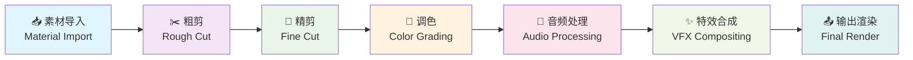

# 数字后期制作 🎬

::: tip 数字后期制作的魅力
**Digital Video Post-Production** 是将创意转化为现实的魔法过程，通过专业技术手段让每一帧画面都达到完美状态。
:::

## 🎯 概述

数字后期制作是现代影视制作流程的核心环节，它不仅仅是技术操作，更是艺术创作的重要组成部分。通过精湛的技术手段，我们能够将原始素材转化为令人震撼的视觉作品。

## ✨ 技术特点

### 📝 非线性编辑
基于时间线的灵活剪辑方式，支持无损编辑和实时调整，让创作过程更加自由。

### 🔍 高质量处理
支持 4K、8K 甚至更高分辨率素材处理，确保画质在整个制作流程中保持最高标准。

### ⚡ 实时预览
即时查看编辑效果，所见即所得的工作方式大幅提高制作效率。

### 🔄 多格式支持
兼容各种主流视频、音频格式，确保素材导入和输出的灵活性。

## 🔄 工作流程

::: info 标准化制作流程
遵循标准化的制作流程能够确保项目质量，提高团队协作效率，减少返工风险。
:::

## 📚 核心模块

### 📖 基础知识

::: info 扎实的理论基础
掌握基础理论是成为优秀后期制作人员的前提，理论指导实践，实践验证理论。
:::

- 🔄 [工作流程概述](./basics/workflow-overview.md) - 后期制作完整流程
- 📹 [视频格式详解](./basics/video-formats.md) - 编解码器和容器格式
- 📋 [项目管理](./basics/project-management.md) - 素材组织和版本控制

### ✂️ 剪辑技术

::: tip 剪辑是讲故事的艺术
好的剪辑不仅仅是技术操作，更是通过镜头语言来讲述故事，传达情感。
:::

- 🎭 [剪辑理论](./editing/theory.md) - 蒙太奇理论和剪辑技巧
- 🎬 [节奏控制](./editing/rhythm.md) - 剪辑节奏与情绪表达
- 🔄 [转场技巧](./editing/transitions.md) - 各种转场效果的运用

### 🎨 调色技术

::: warning 色彩的力量
色彩不仅影响画面美感，更能直接影响观众的情绪和心理感受。
:::

- 🌈 [色彩理论](./color/theory.md) - 色彩空间和调色基础
- 🎯 [风格化调色](./color/stylization.md) - 创意调色技巧
- 📊 [技术调色](./color/technical.md) - 曝光校正与色彩匹配

### 🎵 音频处理

- 🔧 [音频清理](./audio/cleanup.md) - 降噪、去混响、音频修复
- 🎼 [音效设计](./audio/sound-design.md) - 音效制作与应用
- 🎚️ [混音技巧](./audio/mixing.md) - 多轨音频混合处理

### 💻 软件应用

#### 🟦 Adobe Premiere Pro
- 📝 [基础操作](./software/premiere-pro.md) - 界面与基本功能
- 🔧 [高级技巧](./software/premiere-advanced.md) - 插件与工作流优化

#### 🟨 DaVinci Resolve
- 🎨 [调色专精](./software/davinci-resolve.md) - 专业调色工作流
- ✂️ [剪辑功能](./software/davinci-editing.md) - 一体化制作解决方案

#### 🟩 Final Cut Pro
- ⚡ [高效剪辑](./software/final-cut-pro.md) - Mac 平台专业剪辑
- 🔄 [磁性时间线](./software/magnetic-timeline.md) - 独特的编辑方式

### 📤 输出发布

- ⚙️ [导出设置](./output/export-settings.md) - 不同用途的输出参数
- 📱 [平台优化](./output/platform-optimization.md) - 针对不同平台的优化策略
- 🌐 [交付标准](./output/delivery-standards.md) - 行业交付规范

## 🌍 应用领域

::: details 点击查看详细应用场景

### 🎥 影视制作
- 🎬 电影长片后期制作
- 📺 电视剧集制作流程
- 📖 纪录片叙事剪辑
- 🎪 短片创作与实验

### 📺 广告制作
- 💼 商业广告制作
- 🚀 品牌宣传片制作
- 🎵 音乐 MV 制作
- 📱 社交媒体广告

### 🌐 新媒体内容
- 📱 短视频平台内容
- 📺 直播回放剪辑
- 🎮 游戏视频制作
- 📰 新闻媒体内容

### 🎓 教育培训
- 📚 在线课程制作
- 🎯 企业培训视频
- 🔬 科普教育内容
- 💡 技能演示视频

:::

## 💻 技术要求

### 🖥️ 硬件配置

::: tip 硬件投资建议
合理的硬件配置是高效工作的基础，建议根据项目需求和预算进行配置。
:::

#### 🧠 处理器 (CPU)
- **推荐**：Intel i7/i9 或 AMD Ryzen 7/9
- **核心数**：8 核心以上，支持多线程
- **特性**：硬件编解码加速支持

#### 💾 内存 (RAM)
- **最低**：16GB DDR4
- **推荐**：32GB 以上
- **专业级**：64GB+ 用于 4K/8K 项目

#### 💿 存储系统
- **系统盘**：1TB NVMe SSD
- **素材盘**：高速 RAID 阵列
- **归档盘**：大容量 HDD

#### 🎮 显卡 (GPU)
- **NVIDIA**：RTX 4070 以上，支持 CUDA
- **AMD**：RX 7800 XT 以上，支持 OpenCL
- **显存**：12GB 以上推荐

### 🛠️ 软件环境

- **操作系统**：Windows 11 或 macOS Ventura+
- **编辑软件**：Adobe Creative Suite 2024、DaVinci Resolve 18+
- **插件扩展**：Red Giant、Boris FX、FilmConvert 等

## 📏 行业标准

::: info 标准化的重要性
遵循行业标准确保作品质量，提高团队协作效率，满足播出和发行要求。
:::

### 🎨 色彩标准
- **Rec.709**：高清电视标准色彩空间
- **Rec.2020**：4K/8K 超高清标准
- **DCI-P3**：数字电影院标准
- **sRGB**：网络发布标准

### 🎵 音频标准
- **采样率**：48kHz（广播级）/ 96kHz（专业级）
- **位深度**：24bit 最低标准
- **声道配置**：立体声、5.1、7.1 环绕声
- **响度标准**：EBU R128、ATSC A/85

### 📦 交付格式
- **中间格式**：ProRes 422 HQ、DNxHD/HR
- **最终交付**：H.264/H.265、AV1
- **归档格式**：无压缩或轻压缩格式

## 🔮 发展趋势

::: tip 技术发展方向
后期制作技术正在快速发展，AI、云计算、实时渲染等新技术正在重塑整个行业。
:::

### 🤖 AI 辅助剪辑
智能识别和自动剪辑技术，大幅提升制作效率，让创作者专注于创意表达。

### ☁️ 云端协作
远程协作和云渲染服务，打破地域限制，实现全球化团队协作。

### ⚡ 实时渲染
GPU 加速的实时特效处理，所见即所得的制作体验。

### 🌈 HDR 制作
高动态范围内容制作流程，提供更丰富的视觉体验。

### 🎮 虚拟制作
实时引擎与传统制作流程结合，开创全新的制作模式。

### 📱 移动端制作
移动设备性能提升，专业级移动端制作工具兴起。

---

::: quote 💭 创作寄语
掌握数字后期制作技术，让您的创意通过专业的技术手段得到完美呈现。技术是工具，创意是灵魂，两者结合才能创作出真正令人印象深刻的视觉作品。
:::

