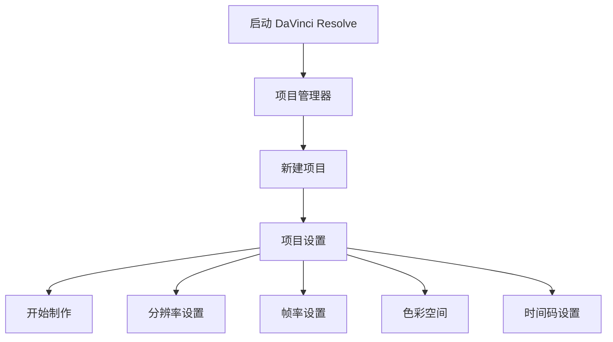
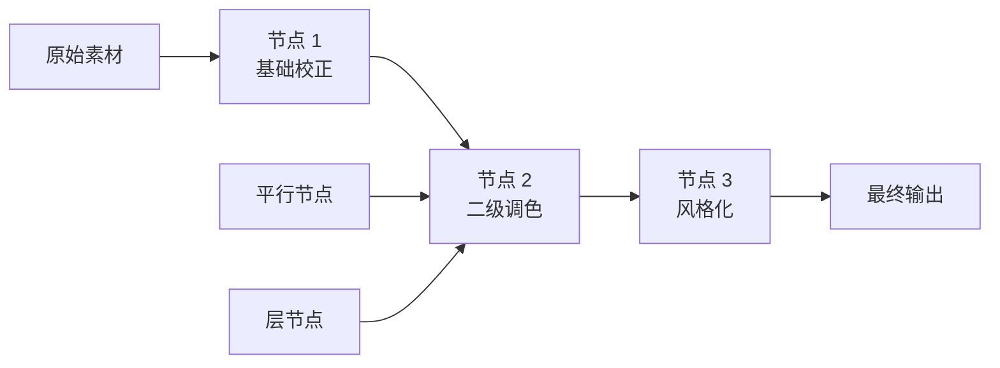
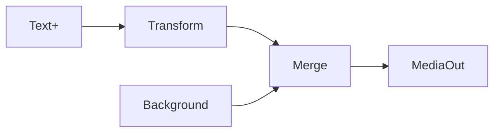
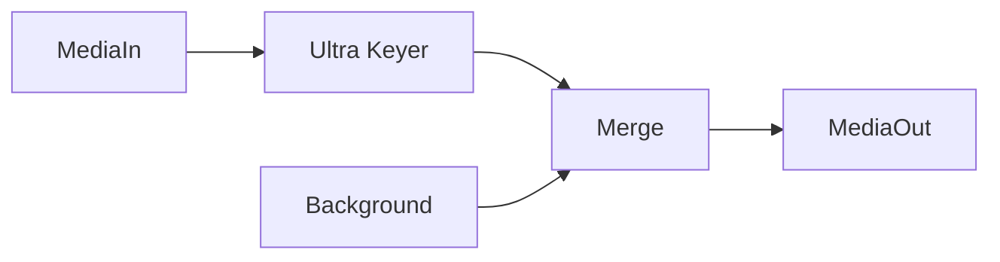
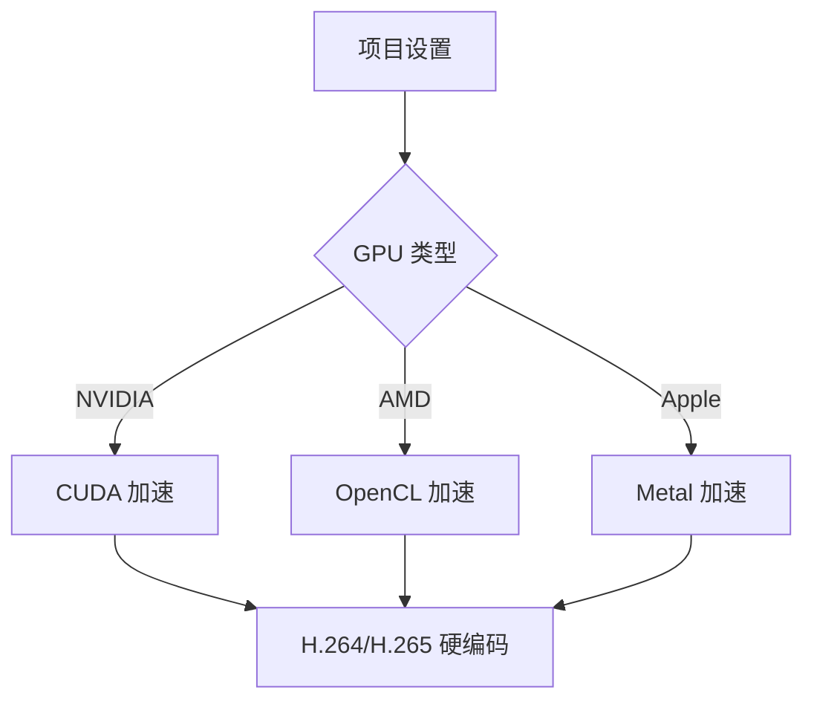
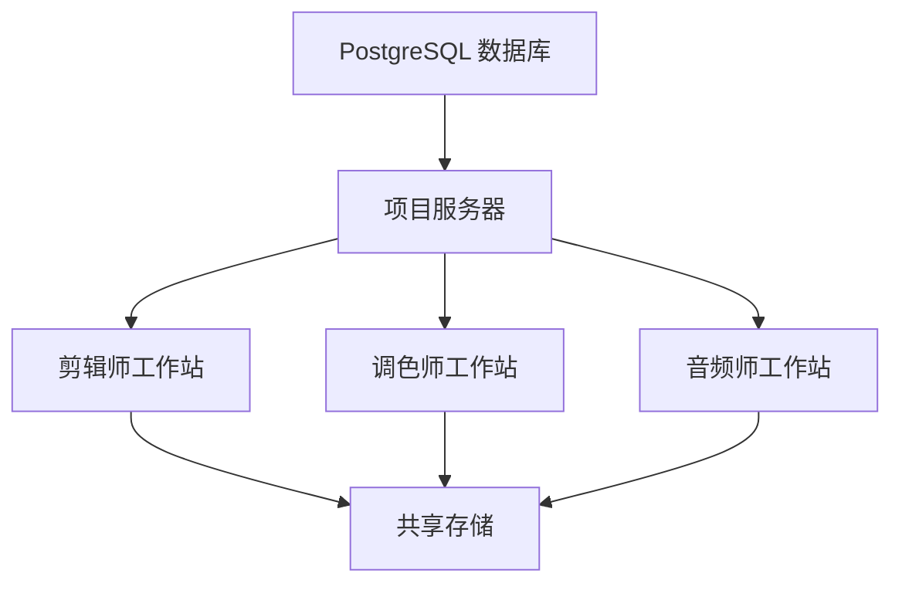

# DaVinci Resolve 教程

::: tip 软件版本
本教程基于 **DaVinci Resolve 20** 编写，涵盖最新的 AI 功能和工作流程。
:::

<div style="display: grid; grid-template-columns: repeat(auto-fit, minmax(280px, 1fr)); gap: 20px; margin: 20px 0;">

<Card 
  icon="/icons/yingshijufeng-logo.webp"
  title="影视飓风达芬奇系列教程" 
  description="一小时上手达芬奇剪辑完整系列" 
  link="https://www.bilibili.com/video/BV1B7411A7M1/?share_source=copy_web&vd_source=979271052367599a413a4f6b368e75cd" 
  linkText="观看教程">

新手入门
介绍使用方法、基础功能。
</Card>

<Card 
  icon="🏆" 
  title="进阶达芬奇教程" 
  description="从基础到高级的完整教程" 
  link="https://www.bilibili.com/video/BV1sr4y1G743/?share_source=copy_web&vd_source=979271052367599a413a4f6b368e75cd" 
  linkText="立即观看">

深入进阶教程
侧重🎨 专业调色。
</Card>

</div>

DaVinci Resolve 是世界上唯一一款将视频剪辑、调色、视觉特效、动态图形和音频后期制作集于一体的专业软件。它被好莱坞专业人士广泛使用，是业界排名第一的后期制作解决方案。

## 🎯 软件概述

### 核心优势

DaVinci Resolve 由 **Blackmagic Design** 开发，具有以下突出特点：

- 🏆 **Emmy™ 获奖技术**：32-bit 浮点处理，专利 YRGB 色彩科学
- 🎨 **专业级调色**：业界领先的色彩校正和分级工具
- 🤖 **AI 智能功能**：DaVinci 20 引入 100+ 项新功能，包括强大的 AI 工具
- 🎬 **完整工作流程**：从剪辑到交付的一站式解决方案
- 👥 **多用户协作**：实时本地和远程协作支持
- 📺 **广泛兼容**：支持 SD 到 32K 分辨率，最高 120fps

### 版本对比

| 功能特性 | 免费版 | Studio 版 |
|---------|--------|----------|
| 基础剪辑和调色 | ✅ | ✅ |
| 分辨率支持 | 最高 Ultra HD (3840×2160) | 最高 32K |
| 帧率支持 | 最高 60fps | 最高 120fps |
| GPU 加速 | 基础支持 | 多 GPU 支持 |
| AI 功能 | 部分 | 完整 DaVinci Neural Engine |
| 高级特效 | 基础 Resolve FX | 40+ 额外 Resolve FX |
| 协作功能 | ✅ | ✅ + 高级管理 |

## 🖥️ 界面和页面布局

DaVinci Resolve 采用**页面式工作区**设计，每个页面专注于特定的后期制作任务：

### 六大核心页面

| 页面 | 图标 | 主要功能 | 适用阶段 |
|------|------|----------|----------|
| 📁 **媒体页面** | Media | 导入、组织和管理素材 | 项目准备 |
| ✂️ **剪辑页面** | Cut | 快速剪辑和粗剪 | 初步编辑 |
| 🎬 **编辑页面** | Edit | 精细编辑和后期处理 | 精剪制作 |
| 🎨 **调色页面** | Color | 专业色彩校正和分级 | 视觉优化 |
| ⚡ **Fusion 页面** | Fusion | 视觉特效和动态图形 | 特效制作 |
| 🎵 **Fairlight 页面** | Fairlight | 音频编辑和混音 | 音频后期 |
| 📤 **发布页面** | Deliver | 渲染和导出项目 | 最终交付 |

::: info 页面切换技巧
使用快捷键 `Shift + 1-7` 可以快速在各页面间切换，提高工作效率。
:::

## 🚀 DaVinci Resolve 20 新功能

### AI 智能工具 

- 🤖 **AI IntelliScript**：基于文本脚本自动创建时间线
- 📝 **AI 动画字幕**：根据语音自动生成动画字幕
- 🎥 **AI 多机位智能切换**：基于说话人检测自动组装多机位时间线
- 🎧 **AI 音频助手**：智能分析音频并创建专业混音
- 🎭 **Magic Mask 增强**：更精确的人物和物体遮罩
- 🌈 **Chroma Warp**：色彩扭曲器的全新色度扭曲功能

### 协作功能升级

- ☁️ **Blackmagic Cloud**：云端项目库和媒体同步
- 🔗 **URL 演示分享**：无需账户即可与客户分享项目预览
- 👥 **组织管理**：企业级用户和许可证管理
- 📁 **云文件夹共享**：轻松分享项目相关素材

## 📋 基本工作流程

### 1. 项目创建与设置



**关键设置项：**
- **分辨率**：1920×1080 (HD)、3840×2160 (4K)、7680×4320 (8K)
- **帧率**：23.98p、24p、25p、29.97p、30p、50p、59.94p、60p
- **色彩空间**：Rec.709、Rec.2020、DCI-P3

### 2. 媒体导入与组织

#### 导入方式
1. **拖拽导入**：直接将文件拖入媒体池
2. **浏览器导入**：使用媒体存储浏览器
3. **批量导入**：选择文件夹批量导入

#### 组织技巧
- 📂 创建**分类箱**按场景、日期或类型分类
- 🏷️ 使用**标签和颜色**标记重要素材
- 🔍 利用**搜索和过滤**快速定位素材
- ⭐ 设置**收藏夹**标记最佳镜头

### 3. 编辑操作进阶

#### 剪辑页面 vs 编辑页面

| 特性 | 剪辑页面 (Cut) | 编辑页面 (Edit) |
|------|----------------|------------------|
| 设计目的 | 快速粗剪 | 精细编辑 |
| 界面布局 | 简化界面 | 完整功能 |
| 时间线 | 双时间线设计 | 传统多轨时间线 |
| 适用场景 | 新手、快速剪辑 | 专业编辑 |

#### 核心编辑工具

- **修剪工具** (`T`)：精确调整剪辑点
- **剃刀工具** (`B`)：分割剪辑
- **滑移工具** (`Y`)：调整剪辑内容而不改变长度
- **滑动工具** (`U`)：移动剪辑位置
- **手型工具** (`H`)：平移时间线视图

## 🎨 专业调色技术

### 调色页面核心工具

DaVinci Resolve 的调色页面是业界标杆，提供专业级色彩校正和分级工具：

#### 主要调色面板

| 工具面板 | 功能描述 | 适用场景 |
|----------|----------|----------|
| 🎡 **色轮** | 调整亮部、中间调、暗部 | 基础色彩平衡 |
| 📈 **曲线** | 精确控制色彩和对比度 | 高级色彩调整 |
| 🎯 **限定器** | 选择性调整特定颜色或区域 | 局部色彩修正 |
| 🌈 **色彩扭曲器** | 创意色彩变换 | 风格化调色 |
| 📊 **HDR 面板** | HDR 内容调色 | HDR 工作流程 |

### 节点式调色系统

DaVinci Resolve 独有的节点系统提供非破坏性调色：



#### 节点类型详解

- **🔗 序列节点**：按顺序处理图像，每个节点的输出成为下一个节点的输入
- **⚡ 平行节点**：并行处理图像的不同部分，最后合并结果
- **📚 层节点**：类似 Photoshop 图层，支持混合模式
- **🎭 外部节点**：处理 Alpha 通道和遮罩

### 专业调色工作流程

#### 1. 一级调色（基础校正）
```
曝光校正 → 白平衡 → 对比度调整 → 饱和度优化
```

#### 2. 二级调色（创意分级）
- 🎯 **Power Window**：几何形状限定
- 🎨 **HSL 限定器**：基于色彩选择
- 🤖 **Magic Mask**：AI 智能遮罩
- 👤 **人脸细化**：自动人脸检测和优化

#### 3. 高级调色技术

**Color Warper 新功能** 
- **Chroma Warp**：色度扭曲，精确控制色彩方向
- **Luma vs Sat**：亮度与饱和度关系调整
- **Hue vs Hue**：色相映射和替换

**HDR 工作流程**
- 支持 **Dolby Vision** 和 **HDR10+** 标准
- **ST.2084** 和 **HLG** 色彩空间
- 专业 **HDR 示波器**，显示 nit 值

### 调色最佳实践

::: tip 专业建议
1. **先校正后分级**：确保技术质量后再进行创意调色
2. **使用参考监视器**：专业监视器确保色彩准确性
3. **保存节点预设**：常用调色效果保存为预设
4. **版本管理**：使用时间线版本功能保存不同调色方案
:::

#### 常用快捷键

| 功能 | 快捷键 | 说明 |
|------|--------|------|
| 添加序列节点 | `Alt + S` | 在当前节点后添加 |
| 添加平行节点 | `Alt + P` | 创建平行处理分支 |
| 添加层节点 | `Alt + L` | 添加图层混合节点 |
| 重置节点 | `Alt + R` | 重置当前节点设置 |
| 启用/禁用节点 | `D` | 快速对比效果 |

## ⚡ Fusion 视觉特效

### Fusion 页面概述

Fusion 是 DaVinci Resolve 内置的专业合成和视觉特效系统，采用节点式工作流程：

#### 核心节点类型

| 节点类别 | 主要节点 | 功能描述 |
|----------|----------|----------|
| 📥 **输入** | MediaIn, Loader | 导入媒体和素材 |
| 📤 **输出** | MediaOut, Saver | 输出和保存结果 |
| 🔄 **变换** | Transform, Corner Pin | 位置、旋转、缩放 |
| 🎭 **合成** | Merge, Over, Screen | 图层混合和合成 |
| 🎨 **生成器** | Text+, Background | 创建文本和背景 |
| 🔧 **修饰器** | Blur, Glow, Color Corrector | 效果和滤镜 |
| 🎯 **遮罩** | Ellipse, Rectangle, Polygon | 形状和遮罩工具 |

### Fusion 20 新功能 

- 🔄 **多层合成工作流程**：更高效的复杂合成管理
- 🎯 **增强的 3D 工作空间**：改进的 3D 合成环境
- 🎨 **新的生成器节点**：更多创意工具
- ⚡ **性能优化**：更快的实时预览

### 常见特效制作

#### 1. 文本动画


#### 2. 绿幕抠像


#### 3. 粒子效果
- **pEmitter**：粒子发射器
- **pRender**：粒子渲染器
- **pTurbulence**：湍流效果
- **pGravity**：重力场

### Fusion 最佳实践

::: warning 性能提示
- 使用 **代理模式** 提高复杂合成的实时性能
- 合理使用 **缓存** 避免重复计算
- **分层合成** 将复杂效果分解为多个简单步骤
:::

## 🎵 Fairlight 专业音频

### Fairlight 音频系统

Fairlight 是业界领先的音频后期制作系统，集成在 DaVinci Resolve 中：

#### 核心功能模块

| 模块 | 功能 | 专业特性 |
|------|------|----------|
| 🎛️ **混音台** | 专业级混音控制 | 1000+ 音轨支持 |
| 🎧 **音频编辑** | 精确音频剪辑 | 样本级精度 |
| 🔊 **动态处理** | 压缩、限制、门限 | 专业音频处理 |
| 🎚️ **EQ 均衡** | 多段参数均衡 | 频谱分析 |
| 🎼 **MIDI 支持** | 虚拟乐器和控制 | 完整 MIDI 工作流程 |
| 🌍 **空间音频** | 环绕声和 3D 音频 | Dolby Atmos 支持 |

### AI 音频功能 

- 🤖 **AI 音频助手**：自动分析和创建专业混音
- 🎤 **AI 语音隔离**：智能分离对话和背景音
- 🎵 **AI 音乐重混器**：自动调整音乐长度和结构
- 💬 **AI 对话分离器**：从复杂音频中提取清晰对话

### 专业音频工作流程

#### 1. 音频清理和修复
```
降噪 → 去除爆音 → 频率修正 → 动态范围优化
```

#### 2. 混音和平衡
- **电平平衡**：确保各音轨音量协调
- **频率分离**：避免频率冲突
- **立体声定位**：创建空间感
- **动态控制**：压缩和限制处理

#### 3. 最终母带处理
- **多段压缩**：整体动态控制
- **立体声增强**：宽度和深度优化
- **响度标准化**：符合广播标准

### 音频格式支持

| 格式类型 | 支持格式 | 最高规格 |
|----------|----------|----------|
| **PCM** | WAV, AIFF | 192kHz/32-bit |
| **压缩** | MP3, AAC, FLAC | 高质量编码 |
| **环绕声** | 5.1, 7.1, Atmos | 完整环绕声支持 |
| **专业** | BWF, OMF, AAF | 行业标准交换 |

## 📤 导出与交付

### Deliver 页面概述

Deliver 页面是 DaVinci Resolve 的最终输出中心，支持多种专业格式和交付标准：

#### 主要导出格式

| 用途分类 | 推荐格式 | 技术规格 | 适用场景 |
|----------|----------|----------|----------|
| 🌐 **网络分发** | H.264/H.265 | 高压缩比 | YouTube, Vimeo, 社交媒体 |
| 🎬 **专业交付** | ProRes 422/4444 | 高质量中间格式 | 电影、广告、纪录片 |
| 📺 **广播标准** | DNxHD/DNxHR | 广播级质量 | 电视台、新闻制作 |
| 🎭 **影院放映** | DCP (Digital Cinema) | 4K/2K 影院标准 | 电影院放映 |
| 📱 **移动设备** | H.264 (MP4) | 优化编码 | 手机、平板观看 |

### DaVinci Resolve 20 导出新功能 

- 🚀 **AI 增强导出**：智能优化编码参数
- ☁️ **云端渲染**：支持云端协作渲染
- 📊 **批量导出管理**：更强大的队列管理
- 🎯 **自定义预设**：保存和共享导出设置

### 渲染优化策略

#### 硬件加速设置


#### 性能优化技巧

::: tip 渲染加速
- **代理媒体**：使用低分辨率代理提高编辑流畅度
- **智能缓存**：启用智能缓存减少重复渲染
- **GPU 内存**：合理分配 GPU 和系统内存
- **多 GPU 支持**：利用多显卡并行渲染
:::

### 质量控制检查单

- [ ] **分辨率匹配**：确认输出分辨率符合要求
- [ ] **帧率一致**：检查帧率设置正确
- [ ] **色彩空间**：验证色彩空间和 Gamma 设置
- [ ] **音频同步**：确认音视频同步无误
- [ ] **字幕嵌入**：检查字幕正确嵌入
- [ ] **元数据完整**：添加必要的元数据信息

## 🔧 高级技巧与工作流程

### 协作工作流程优化

#### 多用户协作设置


- 🗄️ **数据库配置**：PostgreSQL 服务器管理项目
- 📁 **共享存储**：高速网络存储确保素材访问
- 👥 **用户权限**：精细化权限控制
- 🔄 **版本管理**：自动版本控制和冲突解决

### 性能优化进阶

#### 系统配置建议

| 组件 | 推荐配置 | 性能影响 |
|------|----------|----------|
| **CPU** | 16+ 核心 | 编码渲染速度 |
| **内存** | 64GB+ | 大型项目流畅度 |
| **GPU** | RTX 4080/4090 | 实时预览和 GPU 加速 |
| **存储** | NVMe SSD | 素材加载速度 |
| **网络** | 10Gb 以太网 | 协作和共享存储 |

#### 缓存策略

::: warning 缓存管理
- **智能缓存**：自动缓存复杂效果
- **代理媒体**：4K 素材使用 1080p 代理
- **优化媒体**：生成编辑友好的媒体格式
- **缓存清理**：定期清理过期缓存文件
:::

### 自定义工作区

#### 界面个性化
- 💾 **保存布局**：为不同任务创建专用布局
- ⌨️ **快捷键映射**：自定义键盘快捷键
- 🎨 **色彩主题**：选择适合的界面主题
- 📐 **面板配置**：调整面板大小和位置

## ⌨️ 完整快捷键参考

### 通用快捷键

| 功能 | Windows/Linux | macOS | 说明 |
|------|---------------|-------|------|
| 播放/暂停 | 空格键 | 空格键 | 播放控制 |
| 标记入点 | I | I | 设置剪辑起点 |
| 标记出点 | O | O | 设置剪辑终点 |
| 添加编辑点 | Ctrl+B | Cmd+B | 分割剪辑 |
| 渲染缓存 | Ctrl+R | Cmd+R | 渲染时间线 |
| 全屏预览 | Shift+F | Shift+F | 全屏播放 |

### 页面切换快捷键

| 页面 | 快捷键 | 功能 |
|------|--------|------|
| 媒体页面 | Shift+1 | 素材管理 |
| 剪辑页面 | Shift+2 | 快速剪辑 |
| 编辑页面 | Shift+3 | 精细编辑 |
| Fusion 页面 | Shift+4 | 视觉特效 |
| 调色页面 | Shift+5 | 色彩校正 |
| Fairlight 页面 | Shift+6 | 音频处理 |
| 发布页面 | Shift+7 | 导出渲染 |

### 调色页面专用

| 功能 | 快捷键 | 说明 |
|------|--------|------|
| 添加序列节点 | Alt+S | 串联节点 |
| 添加平行节点 | Alt+P | 并行节点 |
| 添加层节点 | Alt+L | 图层节点 |
| 重置节点 | Alt+R | 重置当前节点 |
| 启用/禁用节点 | D | 对比效果 |
| 显示节点图 | Shift+G | 节点编辑器 |

## 📚 学习资源与进阶

### 🎓 官方学习平台

| 资源类型 | 链接 | 内容特色 |
|----------|------|----------|
| 📖 **官方培训** | [DaVinci Resolve Training](https://www.blackmagicdesign.com/products/davinciresolve/training) | 免费认证课程 |
| 📘 **用户手册** | [官方文档](https://www.blackmagicdesign.com/support/) | 完整功能说明 |
| 💬 **官方论坛** | [Blackmagic Forum](https://forum.blackmagicdesign.com/) | 技术支持社区 |
| 🎥 **官方 YouTube** | [Blackmagic Design](https://www.youtube.com/user/BlackmagicDesignTV) | 最新功能演示 |

### 🌟 推荐学习频道

#### 国际优质教程
- **Casey Faris**：基础到进阶完整教程
- **Color Grading Central**：专业调色技术
- **MixingLight**：高端调色理论
- **Resolve Training**：系统性培训课程

#### 中文学习资源
- **调色师社区**：国内专业调色交流
- **影视后期论坛**：技术讨论和案例分享
- **B 站教程**：丰富的中文视频教程

<div style="display: grid; grid-template-columns: repeat(auto-fit, minmax(280px, 1fr)); gap: 20px; margin: 20px 0;">

<Card 
  icon="🎬" 
  title="影视飓风达芬奇系列教程" 
  description="一小时上手达芬奇剪辑完整系列" 
  link="https://www.bilibili.com/video/BV1B7411A7M1/?share_source=copy_web&vd_source=979271052367599a413a4f6b368e75cd" 
  linkText="观看教程">

新手入门
介绍使用方法、基础功能。
</Card>

<Card 
  icon="🏆" 
  title="进阶达芬奇教程" 
  description="从基础到高级的完整教程" 
  link="https://www.bilibili.com/video/BV1sr4y1G743/?share_source=copy_web&vd_source=979271052367599a413a4f6b368e75cd" 
  linkText="立即观看">

深入进阶教程
侧重🎨 专业调色。
</Card>

</div>

### 🎯 学习路径规划

#### 初级阶段（1-2 个月）


#### 中级阶段（3-6 个月）


#### 高级阶段（6 个月以上）


### 💡 实践建议

::: warning 学习要点
1. **项目驱动学习**：通过实际项目掌握技能
2. **循序渐进**：不要急于学习所有功能
3. **社区参与**：积极参与专业社区讨论
4. **持续更新**：关注软件版本更新和新功能
5. **硬件优化**：了解硬件对性能的影响
:::

### 🏆 认证与职业发展

- **Blackmagic Design 认证**：官方认证培训师资格
- **行业认可**：获得专业调色师认证
- **作品集建设**：积累高质量作品案例
- **网络建设**：建立行业人脉关系

---

::: info 总结
**DaVinci Resolve** 是当今最强大的免费专业视频后期制作软件之一。它集成了剪辑、调色、视觉特效、音频后期和交付功能，为创作者提供了完整的后期制作解决方案。

**版本 20** 引入的 AI 功能和性能优化，使其在专业性和易用性之间达到了更好的平衡。无论是独立创作者还是大型制作团队，DaVinci Resolve 都能满足从基础编辑到好莱坞级别制作的需求。

掌握这个软件需要时间和实践，但投入的学习成本将为你的创作能力带来质的飞跃。
:::

DaVinci Resolve 集成了专业视频制作所需的几乎所有工具，掌握它将使你具备完成从剪辑到调色、从特效到音频处理的全方位技能。
